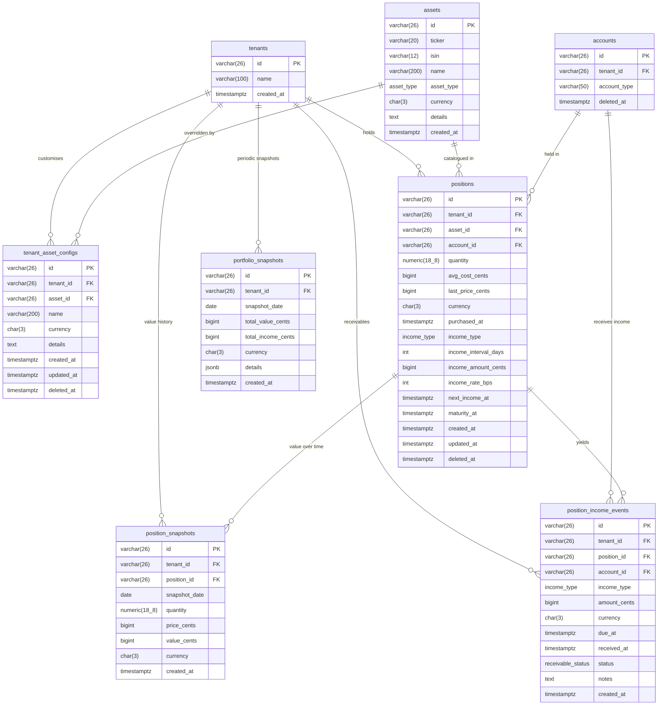

# ADR-003 — Investment Data Model (Positions, Assets, Snapshots, Income & Receivables)

> **Status:** Accepted (revised v3)
> **Date:** 2026-03-13
> **Deciders:** Engineering Team
> **Phase:** 3 — Investment Portfolio Tracking
> **Supersedes:** ADR-003 v1 (2026-03-13)

---

## Table of Contents

1. [Context](#1-context)
2. [Decision](#2-decision)
3. [Entity Definitions](#3-entity-definitions) *(six tables)*
4. [ERD (Mermaid)](#4-erd-mermaid)
5. [Tenant Isolation](#5-tenant-isolation)
6. [Soft-Delete Policy](#6-soft-delete-policy)
7. [Currency & Price-Source Strategy](#7-currency--price-source-strategy)
8. [Snapshot Trigger Mechanism](#8-snapshot-trigger-mechanism)
9. [Fixed-Income & Yield Model](#9-fixed-income--yield-model)
10. [Accounts Receivable Model](#10-accounts-receivable-model)
11. [Consequences](#11-consequences)
12. [Rejected Alternatives](#12-rejected-alternatives)
13. [Open Questions (Resolved)](#13-open-questions-resolved)

---

## 1. Context

Phase 2 stabilised the financial core: accounts, transactions, and the "Master Purchase / Ghost Transaction" pattern for credit card installments. Phase 3 extends Moolah into read-heavy **investment portfolio tracking**.

Before writing a single migration or repository method, the team must agree on:

- How assets are catalogued across tenants, including non-financial assets such as rental properties and jobs.
- How per-tenant positions (holdings) are represented, including cost basis, last-known price, and historical value.
- Whether price history is stored in-app or fetched from an external feed.
- How periodic portfolio snapshots are generated, with frequency controlled by an ENV VAR.
- How fixed-income instruments (rent, coupons, salary) are modelled with configurable yield schedules.
- How accounts receivable (expected-but-not-yet-received income) are tracked as first-class entities.
- How tenant isolation is enforced across all new tables.
- Soft-delete semantics for mutable investment data.

Without this ADR, subsequent tasks (3.2–3.10) risk conflicting assumptions about schema shape and query patterns.

**Revisions in v2** (from post-v1 stakeholder review):

| # | Point raised | Resolution summary |
| - | ------------ | ------------------ |
| 1 | Snapshot frequency should be configurable, not hardcoded monthly | Monthly by default; cron schedule read from `SNAPSHOT_CRON_SCHEDULE` ENV VAR |
| 2 | Full historical position value is needed for trend/forecast dashboards | New `position_snapshots` table; `last_price_cents` alone is insufficient |
| 3 | Fixed-income assets (rent, salary) need income scheduling and yield tracking | Income schedule columns on `positions` + `position_income_events` table |
| 4 | Asset catalogue needs a free-text `details` field for characteristics | `details TEXT` column added to `assets` |
| 5 | Receivables (expected income) must be modelled explicitly | `position_income_events.status` turns the table into a receivables ledger |
| 6 | A job is an asset — it generates a monthly salary receivable | `asset_type` enum extended with `income_source`; job positions have `income_type = 'salary'` |
| 7 | Global assets need per-tenant overrides (currency, alias, notes) | New `tenant_asset_configs` table — sparse override layer; COALESCE query pattern |

---

## 2. Decision

### 2.1 Asset Catalogue — Global, Read-Only Reference Table

Assets (stocks, bonds, funds, crypto, real estate, **and income sources such as employers/jobs**) are **global** — not per-tenant. They represent real-world entities identical regardless of which household holds them. A single `assets` table serves as a read-only reference catalogue populated by admin/seeder.

The `asset_type` enum gains an `income_source` value to cover jobs, freelance contracts, pensions, and any recurring-income source with no intrinsic tradeable capital value. A `details TEXT` column stores free-form characteristics (property address, employer name, CNPJ, fund prospectus URL, investment thesis, etc.).

**Rationale:**

- Avoids duplicating ticker/ISIN data per tenant.
- Simplifies asset search and auto-complete UX.
- Admin-maintained data (seeded via migration or admin API) — tenants do not create assets.

### 2.2 Positions — Per-Tenant Holdings with Income Scheduling

A `positions` row represents a tenant's holding in a specific asset within a specific investment account. In addition to capital fields (quantity, cost basis, last-known price), it carries income-scheduling fields — `income_type`, `income_interval_days`, `income_amount_cents`, `income_rate_bps`, `next_income_at`, and `maturity_at` — that define when and how much the position is expected to yield.

A **job** maps naturally onto this model:

- `asset_type = income_source`, `quantity = 1`, `avg_cost_cents = 0` (no purchase cost).
- `income_type = salary`, `income_interval_days = 30`, `income_amount_cents = <net salary in cents>`.
- `next_income_at` = next payday.
- The linked `account_id` points to the current account that receives the salary.

### 2.3 Position Snapshots — Full Historical Value Record

A new **`position_snapshots`** table captures the value of each position at every snapshot event. This is the authoritative time-series data source for trend charts and future forecast/ML dashboards (Phase 5+). `last_price_cents` on the `positions` row is retained as a "latest known price" convenience field but is not the primary historical record.

### 2.4 Portfolio Snapshots — Periodic Tenant-Level Aggregate

`portfolio_snapshots` aggregates all active `position_snapshots` values at a point in time into a single tenant-level record. Its creation is driven by a cron job whose schedule is read from the `SNAPSHOT_CRON_SCHEDULE` environment variable (default: `0 5 1 * *` — 00:05 UTC on the 1st of each month). A `total_income_cents` column captures the sum of `received` income events in the snapshot period.

### 2.5 Accounts Receivable via `position_income_events`

The **`position_income_events`** table doubles as the **receivables ledger**. Each row has a `status` (`pending` | `received` | `cancelled`). The income scheduler creates a `pending` row when income is due. Marking it `received` (by the tenant or a future automation) optionally triggers a credit `transactions` row in the linked cash account — closing the receivable and recording the cash inflow in one atomic operation.

This models salary, rent, coupons, dividends, and interest as first-class receivables with a distinct lifecycle, not as opaque transactions.

### 2.6 Price History

A dedicated `price_history` table (raw OHLCV) is **not created** for Phase 3 MVP. `position_snapshots` captures `(quantity × price_cents)` per position, which is sufficient for household-scale trend charting. Raw market price history is deferred to Phase 4/5 alongside the live price feed ADR.

### 2.7 Tenant Asset Configuration — Override Layer

The global `assets` table is admin-controlled and read-only for tenants. However, a tenant may need to:

- Display an asset under a **local alias** (e.g. "Apartamento Centro" instead of the generic ticker `APT-4B`).
- Record the asset in a **different currency** than the global default (e.g. hold a US stock as a Brazilian BDR in BRL).
- Add **private notes** that supplement or override the global `details` (e.g. lease contract number, personal appraisal history).
- Track **when they personally added** this asset to their portfolio view.

A dedicated **`tenant_asset_configs`** table holds these per-tenant overrides. It is keyed on `(tenant_id, asset_id)` and every overridable column is nullable — presence means the tenant has set a custom value; NULL means "fall back to the global default".

**Query pattern (COALESCE merge):**

```sql
SELECT
  a.id,
  a.ticker,
  a.isin,
  a.asset_type,
  COALESCE(tac.name,     a.name)     AS name,
  COALESCE(tac.currency, a.currency) AS currency,
  COALESCE(tac.details,  a.details)  AS details,
  tac.created_at AS tenant_added_at,
  a.created_at   AS global_created_at
FROM assets a
LEFT JOIN tenant_asset_configs tac
       ON tac.asset_id = a.id AND tac.tenant_id = $1
WHERE a.id = $2;
```

The `positions` row already carries a `currency` override for the specific holding; `tenant_asset_configs.currency` serves as the **tenant-preferred display currency** for the asset wherever no position-level currency overrides it (e.g. asset search, portfolio summary headers).

---

## 3. Entity Definitions

### 3.1 `assets` — Global Asset Catalogue

> No `tenant_id`. Populated by admin/seeder. Read-only for tenants.

| Column       | Type           | Nullable | Constraints              | Notes                                                                      |
| ------------ | -------------- | -------- | ------------------------ | -------------------------------------------------------------------------- |
| `id`         | `VARCHAR(26)`  | NO       | `PRIMARY KEY`            | ULID                                                                       |
| `ticker`     | `VARCHAR(20)`  | NO       | `NOT NULL`, `UNIQUE`     | e.g. `AAPL`, `BTC`, `VWRL`, `EMPLOYER-ACME`                               |
| `isin`       | `VARCHAR(12)`  | YES      |                          | ISO 6166; nullable for crypto, real estate, income sources                 |
| `name`       | `VARCHAR(200)` | NO       | `NOT NULL`               | Human-readable name                                                        |
| `asset_type` | `asset_type`   | NO       | `NOT NULL`               | Enum: see below                                                            |
| `currency`   | `CHAR(3)`      | NO       | `NOT NULL`               | ISO 4217 base currency; use `BRL`, `USD`, etc.                             |
| `details`    | `TEXT`         | YES      |                          | Free-form characteristics: address, CNPJ, prospectus URL, description, etc.|
| `created_at` | `TIMESTAMPTZ`  | NO       | `NOT NULL DEFAULT NOW()` |                                                                            |

**Enum `asset_type`:**

```sql
CREATE TYPE asset_type AS ENUM (
  'stock',         -- publicly traded equity
  'bond',          -- fixed/floating-rate debt instrument
  'fund',          -- mutual fund, ETF, index fund
  'crypto',        -- digital asset
  'real_estate',   -- property with intrinsic capital value
  'income_source'  -- job, pension, freelance contract — no tradeable capital value
);
```

**Enum `income_type`:**

```sql
CREATE TYPE income_type AS ENUM (
  'none',      -- asset generates no periodic income
  'dividend',  -- equity distributions
  'coupon',    -- bond interest payments
  'rent',      -- real estate lease income
  'interest',  -- savings/deposit interest
  'salary'     -- employment remuneration
);
```

**Enum `receivable_status`:**

```sql
CREATE TYPE receivable_status AS ENUM ('pending', 'received', 'cancelled');
```

**Indexes:**

- `UNIQUE (ticker)` — globally unique ticker symbol.
- Index on `asset_type` for filtering by category.

---

### 3.2 `tenant_asset_configs` — Per-Tenant Asset Overrides

> Includes `tenant_id`. Mutable; soft-deletable. One row per (tenant, asset) pair.

| Column       | Type           | Nullable | Constraints                                   | Notes                                                                    |
| ------------ | -------------- | -------- | --------------------------------------------- | ------------------------------------------------------------------------ |
| `id`         | `VARCHAR(26)`  | NO       | `PRIMARY KEY`                                 | ULID                                                                     |
| `tenant_id`  | `VARCHAR(26)`  | NO       | `NOT NULL`, `FK → tenants(id)`                | Tenant isolation                                                         |
| `asset_id`   | `VARCHAR(26)`  | NO       | `NOT NULL`, `FK → assets(id)`                 | Reference to global catalogue entry                                      |
| `name`       | `VARCHAR(200)` | YES      |                                               | Local display alias; overrides `assets.name` when set                    |
| `currency`   | `CHAR(3)`      | YES      |                                               | Tenant-preferred display currency; overrides `assets.currency` when set  |
| `details`    | `TEXT`         | YES      |                                               | Private notes / supplementary info; overrides `assets.details` when set  |
| `created_at` | `TIMESTAMPTZ`  | NO       | `NOT NULL DEFAULT NOW()`                      | When this tenant first configured the asset                              |
| `updated_at` | `TIMESTAMPTZ`  | NO       | `NOT NULL DEFAULT NOW()`                      | Last update to any override field                                        |
| `deleted_at` | `TIMESTAMPTZ`  | YES      |                                               | Soft-delete; restores global defaults when set                           |

**Unique Constraint:**

```sql
UNIQUE (tenant_id, asset_id) WHERE deleted_at IS NULL
```

**Indexes:**

- `(tenant_id, asset_id)` — primary lookup path for the COALESCE merge query.
- `(tenant_id, deleted_at)` — tenant-scoped listing of configured assets.

**Override semantics:**

| Field | NULL in `tenant_asset_configs` | Non-NULL in `tenant_asset_configs` |
| ----- | ------------------------------ | ---------------------------------- |
| `name` | Use `assets.name` | Show tenant alias |
| `currency` | Use `assets.currency` | Use tenant's preferred currency |
| `details` | Use `assets.details` | Show tenant's private notes |

Deleting the config row (soft-delete) restores all global defaults for the tenant without losing the history of what was configured.

---

### 3.3 `positions` — Per-Tenant Holdings

> Includes `tenant_id`. Soft-deletable. One active row per (tenant, asset, account) combination.

#### Capital fields

| Column             | Type            | Nullable | Constraints                                           | Notes                                            |
| ------------------ | --------------- | -------- | ----------------------------------------------------- | ------------------------------------------------ |
| `id`               | `VARCHAR(26)`   | NO       | `PRIMARY KEY`                                         | ULID                                             |
| `tenant_id`        | `VARCHAR(26)`   | NO       | `NOT NULL`, `FK → tenants(id)`                        | Tenant isolation                                 |
| `asset_id`         | `VARCHAR(26)`   | NO       | `NOT NULL`, `FK → assets(id)`                         | References global catalogue                      |
| `account_id`       | `VARCHAR(26)`   | NO       | `NOT NULL`, `FK → accounts(id)`                       | Must be an account of type `investment`          |
| `quantity`         | `NUMERIC(18,8)` | NO       | `NOT NULL`, `CHECK (quantity >= 0)`                   | Fractional shares supported; use `1` for jobs    |
| `avg_cost_cents`   | `BIGINT`        | NO       | `NOT NULL DEFAULT 0`, `CHECK (avg_cost_cents >= 0)`   | Weighted average cost per unit; `0` for jobs     |
| `last_price_cents` | `BIGINT`        | NO       | `NOT NULL DEFAULT 0`, `CHECK (last_price_cents >= 0)` | Latest known capital value per unit              |
| `currency`         | `CHAR(3)`       | NO       | `NOT NULL`                                            | ISO 4217; position-level (may differ from asset) |
| `purchased_at`     | `TIMESTAMPTZ`   | NO       | `NOT NULL`                                            | Date of first purchase / job start date          |

#### Income / yield scheduling fields

| Column                 | Type          | Nullable | Constraints                        | Notes                                                         |
| ---------------------- | ------------- | -------- | ---------------------------------- | ------------------------------------------------------------- |
| `income_type`          | `income_type` | NO       | `NOT NULL DEFAULT 'none'`          | Type of periodic income this position generates               |
| `income_interval_days` | `INT`         | YES      | `CHECK (income_interval_days > 0)` | Recurrence interval; NULL when `income_type = 'none'`         |
| `income_amount_cents`  | `BIGINT`      | YES      | `CHECK (income_amount_cents >= 0)` | Fixed income per interval (rent, fixed coupon, salary)        |
| `income_rate_bps`      | `INT`         | YES      | `CHECK (income_rate_bps >= 0)`     | Yield rate in basis points; 100 bps = 1% per interval         |
| `next_income_at`       | `TIMESTAMPTZ` | YES      |                                    | Next expected income date; updated by scheduler after each event |
| `maturity_at`          | `TIMESTAMPTZ` | YES      |                                    | Optional maturity date for bonds and fixed-term deposits       |

**Income validation rule:** if `income_type != 'none'` then `income_interval_days` must be non-null, and at least one of `income_amount_cents` or `income_rate_bps` must be non-null.

#### Audit fields

| Column       | Type          | Nullable | Constraints              | Notes                             |
| ------------ | ------------- | -------- | ------------------------ | --------------------------------- |
| `created_at` | `TIMESTAMPTZ` | NO       | `NOT NULL DEFAULT NOW()` |                                   |
| `updated_at` | `TIMESTAMPTZ` | NO       | `NOT NULL DEFAULT NOW()` | Updated on any field change       |
| `deleted_at` | `TIMESTAMPTZ` | YES      |                          | NULL = active; set = soft-deleted |

**Unique Constraint:**

```sql
UNIQUE (tenant_id, asset_id, account_id) WHERE deleted_at IS NULL
```

**Indexes:**

- `(tenant_id, deleted_at)` — tenant-scoped listing.
- `(tenant_id, account_id, deleted_at)` — account-scoped listing.
- `(next_income_at)` WHERE `income_type != 'none' AND deleted_at IS NULL` — income scheduler polling.

---

### 3.4 `position_snapshots` — Per-Position Historical Value Record

> Append-only. One row per position per snapshot event. Primary source for trend/forecast dashboards.

| Column          | Type            | Nullable | Constraints                            | Notes                                              |
| --------------- | --------------- | -------- | -------------------------------------- | -------------------------------------------------- |
| `id`            | `VARCHAR(26)`   | NO       | `PRIMARY KEY`                          | ULID                                               |
| `tenant_id`     | `VARCHAR(26)`   | NO       | `NOT NULL`, `FK → tenants(id)`         | Denormalised for fast tenant-level time-series     |
| `position_id`   | `VARCHAR(26)`   | NO       | `NOT NULL`, `FK → positions(id)`       |                                                    |
| `snapshot_date` | `DATE`          | NO       | `NOT NULL`                             | Calendar date of snapshot                          |
| `quantity`      | `NUMERIC(18,8)` | NO       | `NOT NULL`                             | Quantity at snapshot time                          |
| `price_cents`   | `BIGINT`        | NO       | `NOT NULL`, `CHECK (price_cents >= 0)` | Unit price at snapshot time                        |
| `value_cents`   | `BIGINT`        | NO       | `NOT NULL`, `CHECK (value_cents >= 0)` | `ROUND(quantity * price_cents)` at snapshot time   |
| `currency`      | `CHAR(3)`       | NO       | `NOT NULL`                             | ISO 4217                                           |
| `created_at`    | `TIMESTAMPTZ`   | NO       | `NOT NULL DEFAULT NOW()`               |                                                    |

**Unique Constraint:** `UNIQUE (position_id, snapshot_date)`

**Indexes:**

- `(tenant_id, snapshot_date DESC)` — tenant-level time-series queries.
- `(position_id, snapshot_date DESC)` — per-position trend chart.

---

### 3.5 `position_income_events` — Receivables & Yield Ledger

> Append-only. One row per income event (pending receivable or confirmed receipt).

| Column        | Type                | Nullable | Constraints                             | Notes                                                                     |
| ------------- | ------------------- | -------- | --------------------------------------- | ------------------------------------------------------------------------- |
| `id`          | `VARCHAR(26)`       | NO       | `PRIMARY KEY`                           | ULID                                                                      |
| `tenant_id`   | `VARCHAR(26)`       | NO       | `NOT NULL`, `FK → tenants(id)`          | Denormalised for fast queries                                             |
| `position_id` | `VARCHAR(26)`       | NO       | `NOT NULL`, `FK → positions(id)`        |                                                                           |
| `account_id`  | `VARCHAR(26)`       | NO       | `NOT NULL`, `FK → accounts(id)`         | Cash account that will receive / has received the income                  |
| `income_type` | `income_type`       | NO       | `NOT NULL`                              | Type of income (mirrors `positions.income_type`)                          |
| `amount_cents`| `BIGINT`            | NO       | `NOT NULL`, `CHECK (amount_cents > 0)`  | Expected or actual amount in cents                                        |
| `currency`    | `CHAR(3)`           | NO       | `NOT NULL`                              | ISO 4217                                                                  |
| `due_at`      | `TIMESTAMPTZ`       | NO       | `NOT NULL`                              | When the income is expected to be received                                |
| `received_at` | `TIMESTAMPTZ`       | YES      |                                         | When actually received; NULL while `status = 'pending'`                   |
| `status`      | `receivable_status` | NO       | `NOT NULL DEFAULT 'pending'`            | `pending` → open receivable; `received` → closed; `cancelled` → written off |
| `notes`       | `TEXT`              | YES      |                                         | Free-text description (e.g. "March rent – Apt 4B", "April salary")        |
| `created_at`  | `TIMESTAMPTZ`       | NO       | `NOT NULL DEFAULT NOW()`                |                                                                           |

**Indexes:**

- `(tenant_id, due_at DESC)` — tenant receivables list.
- `(tenant_id, status)` WHERE `status = 'pending'` — open receivables dashboard.
- `(position_id, due_at DESC)` — per-position yield history.
- `(account_id, received_at DESC)` — account cash-flow reconciliation.

---

### 3.6 `portfolio_snapshots` — Periodic Tenant-Level Aggregate

> Append-only; never mutated after creation. Aggregates `position_snapshots` for the snapshot period.

| Column               | Type          | Nullable | Constraints                                  | Notes                                                         |
| -------------------- | ------------- | -------- | -------------------------------------------- | ------------------------------------------------------------- |
| `id`                 | `VARCHAR(26)` | NO       | `PRIMARY KEY`                                | ULID                                                          |
| `tenant_id`          | `VARCHAR(26)` | NO       | `NOT NULL`, `FK → tenants(id)`               | Tenant isolation                                              |
| `snapshot_date`      | `DATE`        | NO       | `NOT NULL`                                   | First calendar day of the snapshotted period                  |
| `total_value_cents`  | `BIGINT`      | NO       | `NOT NULL`, `CHECK (total_value_cents >= 0)` | Sum of all position values converted to reference currency    |
| `total_income_cents` | `BIGINT`      | NO       | `NOT NULL DEFAULT 0`                         | Sum of `received` income events in the period                 |
| `currency`           | `CHAR(3)`     | NO       | `NOT NULL`                                   | ISO 4217 reference currency for the totals                    |
| `details`            | `JSONB`       | YES      |                                              | Per-position breakdown; schema described below                |
| `created_at`         | `TIMESTAMPTZ` | NO       | `NOT NULL DEFAULT NOW()`                     |                                                               |

**Unique Constraint:** `UNIQUE (tenant_id, snapshot_date)`

**`details` JSONB schema (informational):**

```json
{
  "positions": [
    {
      "position_id": "01JNXXXXXXXXXX",
      "asset_id": "01JNXXXXXXXXXX",
      "ticker": "AAPL",
      "asset_type": "stock",
      "quantity": "10.00000000",
      "price_cents": 19500,
      "value_cents": 195000,
      "currency": "USD",
      "weight_pct": 28.5,
      "income_received_cents": 0
    },
    {
      "position_id": "01JNYYYYYYYYYY",
      "asset_id": "01JNYYYYYYYYYY",
      "ticker": "APT-4B",
      "asset_type": "real_estate",
      "quantity": "1.00000000",
      "price_cents": 45000000,
      "value_cents": 45000000,
      "currency": "BRL",
      "weight_pct": 65.7,
      "income_received_cents": 300000
    },
    {
      "position_id": "01JNZZZZZZZZZ",
      "asset_id": "01JNZZZZZZZZZ",
      "ticker": "EMPLOYER-ACME",
      "asset_type": "income_source",
      "quantity": "1.00000000",
      "price_cents": 0,
      "value_cents": 0,
      "currency": "BRL",
      "weight_pct": 0,
      "income_received_cents": 850000
    }
  ]
}
```

**Indexes:**

- `(tenant_id, snapshot_date DESC)` — time-series chart queries.

---

## 4. ERD (Mermaid)



---

## 5. Tenant Isolation

All investment tables follow the same row-level isolation pattern established in Phases 1 and 2:

| Table                    | `tenant_id` column | Isolation mechanism                                     |
| ------------------------ | ------------------ | ------------------------------------------------------- |
| `assets`                 | ❌ absent          | Global catalogue; no tenant data stored here            |
| `tenant_asset_configs`   | ✅ `VARCHAR(26)`   | Every query **must** include `WHERE tenant_id = $1`     |
| `positions`              | ✅ `VARCHAR(26)`   | Every query **must** include `WHERE tenant_id = $1`     |
| `position_snapshots`     | ✅ `VARCHAR(26)`   | Every query **must** include `WHERE tenant_id = $1`     |
| `position_income_events` | ✅ `VARCHAR(26)`   | Every query **must** include `WHERE tenant_id = $1`     |
| `portfolio_snapshots`    | ✅ `VARCHAR(26)`   | Every query **must** include `WHERE tenant_id = $1`     |

**Rules:**

1. `tenant_id` is extracted from the validated PASETO token by `middleware/auth.go` and stored in `context.Context`.
2. All `sqlc` queries for tenant-scoped tables **must** accept `tenant_id` as the first parameter.
3. No cross-tenant joins are permitted. The `assets` table may be joined without a tenant filter.
4. The repository layer **never** accepts `tenant_id` from caller-supplied request bodies — always from context.
5. `tenant_id` is **denormalised** onto `position_snapshots` and `position_income_events` to enable efficient tenant-level time-series queries without joining back to `positions`.

---

## 6. Soft-Delete Policy

| Table                    | Soft-delete column | Policy                                                                                                  |
| ------------------------ | ------------------ | ------------------------------------------------------------------------------------------------------- |
| `assets`                 | ❌ none            | Global catalogue; deletion disallowed while any active position references the asset.                              |
| `tenant_asset_configs`   | ✅ `deleted_at`    | Soft-delete restores all global defaults for the tenant. History of overrides preserved for audit.                 |
| `positions`              | ✅ `deleted_at`    | Set `deleted_at = NOW()` on close/sell/resignation. Active queries always add `AND deleted_at IS NULL`.            |
| `position_snapshots`     | ❌ none            | Append-only historical records. Deletion not permitted.                                                            |
| `position_income_events` | ❌ none            | Append-only financial records. Use `status = 'cancelled'` to write off a receivable; never hard-delete.            |
| `portfolio_snapshots`    | ❌ none            | Append-only aggregate records. Deletion not permitted.                                                             |

All `sqlc` queries for `positions` **must** include `AND deleted_at IS NULL` unless the query is explicitly for audit/history purposes.

---

## 7. Currency & Price-Source Strategy

### MVP (Phase 3)

- **Price source:** Manual entry only. The tenant updates `last_price_cents` on a `positions` row via the API.
- **Currency conversion:** A **static rate table** (`exchange_rates`) is introduced in Task 3.10 (see `docs/tasks/TASK_3.10_currency-conversion-hook.md`). Rates are loaded from a seed file or admin endpoint; no external API calls in MVP.
- **Snapshot currency:** Each `portfolio_snapshots` row has a `currency` field. For a multi-currency portfolio, all position values are converted to the tenant's reference currency using the static rate at snapshot time.
- **No `float64`:** All monetary values in `positions` and `portfolio_snapshots` are stored as `BIGINT` cents. Price lookups and currency conversion use integer arithmetic with explicit rounding rules (round half up at the cent boundary).

### Future (Phase 4/5)

A future ADR will introduce a live price feed integration (e.g., Alpha Vantage, Yahoo Finance, or a WebSocket stream). The `CurrencyConverter` interface introduced in Task 3.10 provides the extension hook without requiring a schema change.

---

## 8. Snapshot Trigger Mechanism

The snapshot cron schedule is read from the `SNAPSHOT_CRON_SCHEDULE` environment variable at startup.

| ENV VAR                  | Default            | Format         |
| ------------------------ | ------------------ | -------------- |
| `SNAPSHOT_CRON_SCHEDULE` | `0 5 1 * *`        | Standard cron (minute hour day month weekday) |

Default `0 5 1 * *` = 00:05 UTC on the 1st of each month. Operators can change this to bi-weekly (`0 5 1,15 * *`), quarterly, etc. without redeploying code.

**Scheduler behaviour:**

1. At startup, the `SnapshotJob` goroutine parses `SNAPSHOT_CRON_SCHEDULE` and sets the next run time.
2. On each trigger, it reads all active positions for every tenant, converts values to the tenant's reference currency, writes one `portfolio_snapshots` row per tenant, and writes `position_snapshots` rows for every active position.
3. An idempotency check on `UNIQUE (tenant_id, snapshot_date)` and `UNIQUE (position_id, snapshot_date)` prevents duplicate rows if the job runs twice for the same period.
4. `POST /v1/investments/snapshot` triggers an on-demand run for dev/test and manual back-fills.

| Option                         | Decision         | Reasoning                                                             |
| ------------------------------ | ---------------- | --------------------------------------------------------------------- |
| In-process cron, ENV-configurable | ✅ **Chosen**  | Flexible cadence; zero external dependencies for MVP.                 |
| External scheduler (k8s CronJob) | ⏸️ Deferred   | Multi-instance concern; revisit in Phase 5.                          |
| Event-driven (on price update) | ⏸️ Deferred     | Valid for Phase 4+ live feed; overkill for manual-entry MVP.          |
| Hardcoded monthly cron         | ❌ Rejected      | Inflexible; forces all deployments to share one cadence.              |
| Manual API trigger only        | ✅ Also supported | Necessary for dev/test and user-on-demand flows.                      |

---

## 9. Fixed-Income & Yield Model

### 9.1 Supported Income Types

| `income_type` | Example assets                     | Typical interval  | Amount basis                  |
| ------------- | ---------------------------------- | ----------------- | ----------------------------- |
| `rent`        | Rental property, commercial lease  | 30 days           | Fixed `income_amount_cents`   |
| `coupon`      | Government bond, corporate bond    | 180 days          | Fixed or `income_rate_bps`    |
| `dividend`    | Stock, REIT fund unit              | 90 or 365 days    | `income_rate_bps`             |
| `interest`    | CDB, LCI, savings certificate      | 30 days           | `income_rate_bps`             |
| `salary`      | Job, pension, freelance contract   | 30 days           | Fixed `income_amount_cents`   |
| `none`        | Growth stock, crypto, vacant land  | N/A               | N/A                           |

### 9.2 Income Scheduler

A companion goroutine polls every hour:

```sql
SELECT id FROM positions
WHERE deleted_at IS NULL
  AND income_type != 'none'
  AND next_income_at <= NOW();
```

For each qualifying position it:

1. Creates a `position_income_events` row with `status = 'pending'` and `due_at = next_income_at`.
2. Advances `positions.next_income_at = next_income_at + (income_interval_days * INTERVAL '1 day')`.

When the tenant (or automation) marks the event `received`:
3. Sets `received_at = NOW()`.
4. Optionally creates a credit `transactions` row in the linked cash account.

### 9.3 Fixed Amount vs. Rate-Based Income

- **Fixed** (`income_amount_cents` set): Rent, salary, fixed coupon. Same amount each interval.
- **Rate-based** (`income_rate_bps` set): Amount computed as `ROUND((quantity * last_price_cents * income_rate_bps) / 10000)` at scheduler run time.
- **Hybrid** (both set): Base fixed amount plus a variable rate component (e.g. inflation-linked bond).

### 9.4 Rental Property Example

```
Asset:    ticker = "APT-4B", asset_type = real_estate, currency = BRL
          details = "Rua das Flores 123, Ap 4B, São Paulo. IPTU 2026: R$ 1.200."
Position: quantity = 1, avg_cost_cents = 42_000_000 (R$ 420,000)
          last_price_cents = 45_000_000 (R$ 450,000 — manual annual appraisal)
          income_type = rent, income_interval_days = 30
          income_amount_cents = 300_000 (R$ 3,000/month fixed rent)
          next_income_at = 2026-04-01T00:00:00Z
```

### 9.5 Job / Salary Example

```
Asset:    ticker = "EMPLOYER-ACME", asset_type = income_source, currency = BRL
          details = "Acme Corp Ltda — CNPJ 00.000.000/0001-00. CLT. Área: Engenharia."
Position: quantity = 1, avg_cost_cents = 0 (no purchase cost)
          last_price_cents = 0 (no capital value)
          income_type = salary, income_interval_days = 30
          income_amount_cents = 850_000 (R$ 8,500/month net)
          next_income_at = 2026-04-05T00:00:00Z  (next payday)
```

---

## 10. Accounts Receivable Model

`position_income_events` is the **receivables ledger** for all investment income. The `status` column creates a three-state lifecycle:

```
pending  →  received   (income confirmed; optional cash transaction created)
         →  cancelled  (receivable written off; no cash impact)
```

**Receivables dashboard query:**

```sql
SELECT pie.*, a.ticker, a.name
FROM position_income_events pie
JOIN positions p ON p.id = pie.position_id
JOIN assets a ON a.id = p.asset_id
WHERE pie.tenant_id = $1
  AND pie.status = 'pending'
ORDER BY pie.due_at ASC;
```

**Key points:**

- Rent, salary, and coupons all appear as `pending` receivables before confirmed.
- Confirming receipt (`status = 'received'`) is a deliberate tenant action — the system does not auto-confirm.
- A cancelled receivable (tenant waived rent, salary advance deducted) sets `status = 'cancelled'` with a `notes` explanation; no record is deleted.
- Future automation (bank feed import, Phase 4) can match incoming transactions to `pending` receivables and auto-confirm them.

---

## 11. Consequences

### Positive

- **Full history from day one** — `position_snapshots` provides the time-series baseline needed for trend and forecast dashboards from the first day a position exists.
- **First-class receivables** — salary, rent, coupons, and dividends are tracked with a pending/received lifecycle, not buried in opaque transactions.
- **Jobs as assets** — a job is modelled as a `income_source` asset; salary is a receivable like any other yield. No special-casing.
- **Configurable snapshot cadence** — the `SNAPSHOT_CRON_SCHEDULE` ENV VAR gives operators full flexibility without code changes.
- **Tenant asset customisation** — `tenant_asset_configs` lets tenants personalise display names, preferred currency, and private notes without polluting the shared catalogue.
- **Consistent patterns** — six tables follow the same ULID, soft-delete, and tenant-isolation conventions as Phases 1 & 2.
- **Extensible** — `CurrencyConverter` interface, JSONB `details` on portfolio snapshots, and `details TEXT` on assets provide hooks for live feeds and richer UX without schema changes.

### Negative / Trade-offs

- **More tables** (six vs. v1's three) — more writes per snapshot/income event. Acceptable at household scale.
- **COALESCE merge query** — every asset read requires a LEFT JOIN on `tenant_asset_configs`. Negligible overhead for household-scale read patterns; a future view or materialised cache can absorb it at scale.
- **Denormalised `tenant_id`** on child tables — insert-only trade-off for query performance; acceptable.
- **Rate-based income uses `last_price_cents` at scheduler time** — not guaranteed market-close price. Acceptable for manual-entry MVP; Phase 4 live-feed ADR will address this.
- **Global asset catalogue** — admin must add new assets. Mitigated by shipping a broad default seed.

---

## 12. Rejected Alternatives

| Alternative                                  | Reason Rejected                                                                             |
| -------------------------------------------- | ------------------------------------------------------------------------------------------- |
| Full per-tenant asset tables                 | Data duplication; ticker search scans all tenant shards; global catalogue consistency lost. |
| Override fields on `positions` only          | `positions` already has `currency`; but a position-less asset config (e.g. watchlist entry) would have nowhere to live. `tenant_asset_configs` is more general. |
| JSONB `tenant_overrides` column on `assets`  | Non-queryable without GIN index; mixes global and tenant data in a single table; complicates tenant isolation rules. |
| Hardcoded monthly snapshot cron              | Inflexible; different deployments may need quarterly or bi-weekly cadence.                  |
| `price_history` table (raw OHLCV)            | Over-engineering for MVP; `position_snapshots` (value = qty × price) is sufficient for charting. |
| Income events as plain `transactions`        | Lacks structured metadata (income_type, position linkage, status); makes yield analytics impossible. |
| Storing monetary values as `NUMERIC(19,4)`   | `BIGINT` cents is the established convention (ADR-001); consistency trumps fractional cents. |
| Separate `snapshot_positions` child table    | Adds a join for every chart query; `position_snapshots` already provides per-position time-series. |
| Per-position snapshot interval on `positions`| Complicates the scheduler significantly; a single ENV-configurable cron with ad-hoc manual trigger covers the same need more simply. |

---

## 13. Open Questions (Resolved)

| # | Question                                                                                       | Resolution                                                                                                             |
| - | ---------------------------------------------------------------------------------------------- | ---------------------------------------------------------------------------------------------------------------------- |
| 1 | Should `assets` be global (shared across tenants) or per-tenant?                              | **Global.** Assets are real-world entities, not tenant-specific. See §2.1.                                             |
| 2 | What is the snapshotting trigger and cadence?                                                  | **In-process cron** driven by `SNAPSHOT_CRON_SCHEDULE` ENV VAR (default monthly). Manual API also supported. See §8.  |
| 3 | Should `positions` link to an `accounts` row of type `investment`, or be standalone?           | **Linked to `accounts`.** Keeps investment cash flows visible in the account ledger. See §3.2.                         |
| 4 | Do we need a `price_history` table?                                                            | **No.** `position_snapshots` covers position-level value history. Raw OHLCV deferred to Phase 4/5.                    |
| 5 | How are fixed-income assets (rental properties, bonds) modelled?                              | Income scheduling columns on `positions` + `position_income_events` table. See §9.                                    |
| 6 | How is periodic yield (every N days) handled?                                                  | `income_interval_days` + `next_income_at` on positions; income scheduler advances cursor after each event. See §9.2.  |
| 7 | How is a job / employer modelled?                                                              | `asset_type = income_source`; salary = `income_type = salary` with `income_amount_cents`. See §9.5.                   |
| 8 | How are accounts receivable tracked?                                                           | `position_income_events.status` (`pending` / `received` / `cancelled`) is the receivables ledger. See §10.            |
| 9 | Where do asset characteristics (address, CNPJ, description) live?                             | `assets.details TEXT` — free-form, no length cap for Phase 3. Structured fields deferred to Phase 4+.                 |
| 10 | Should tenants be able to customise asset names, currency, and notes without affecting the global catalogue? | **Yes.** `tenant_asset_configs` sparse override table with COALESCE merge pattern. See §2.7 and §3.2. |
