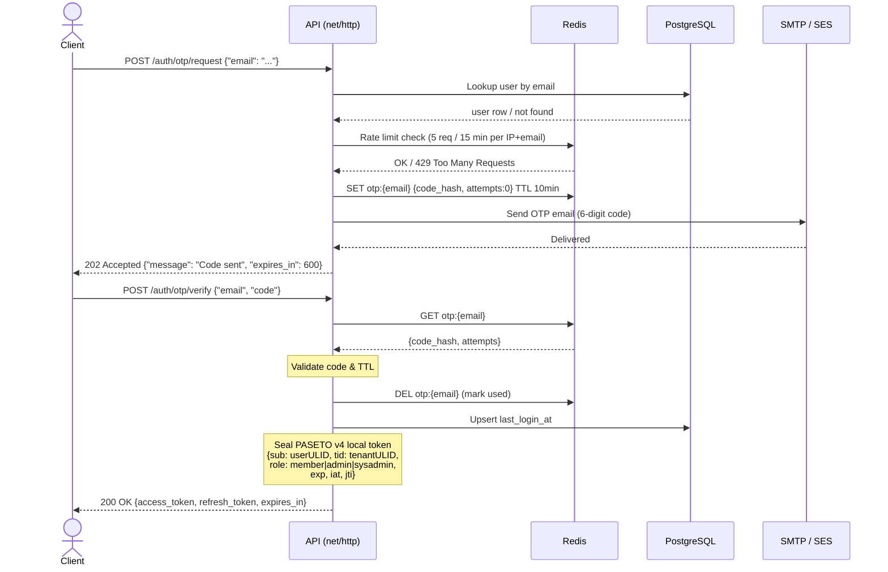
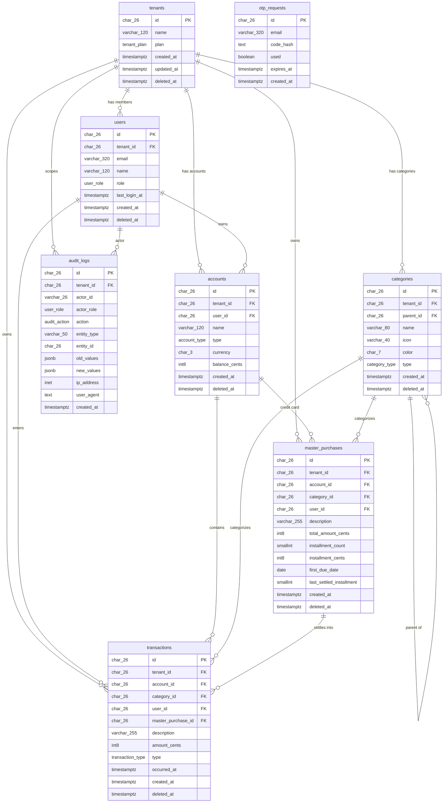
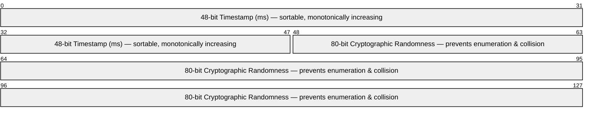
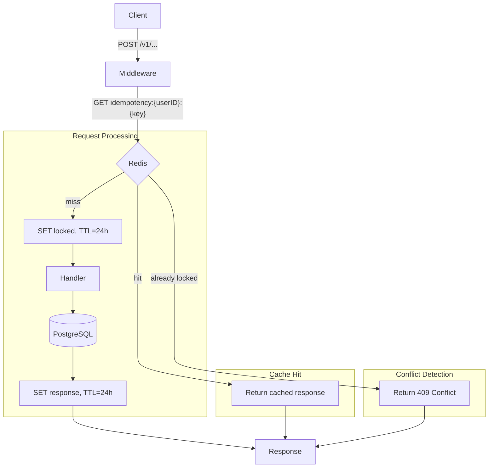
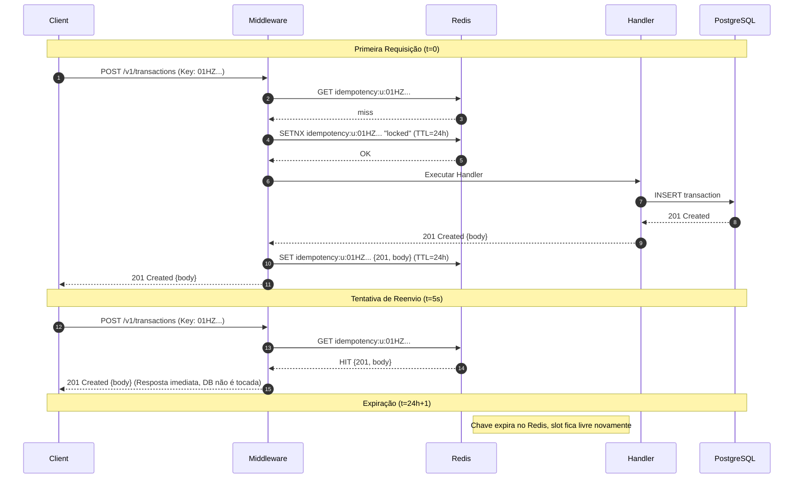
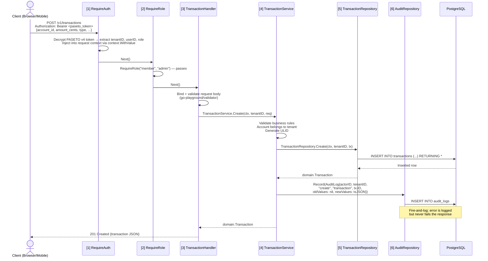
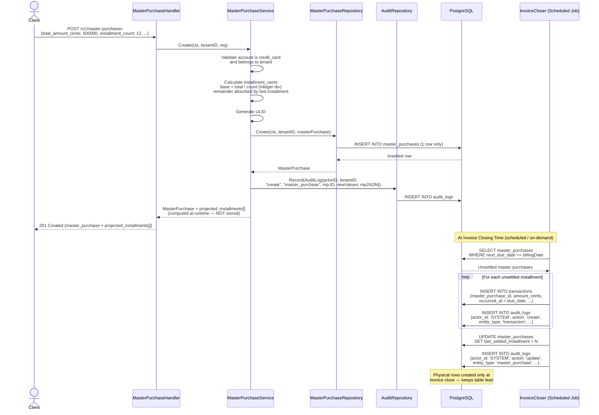
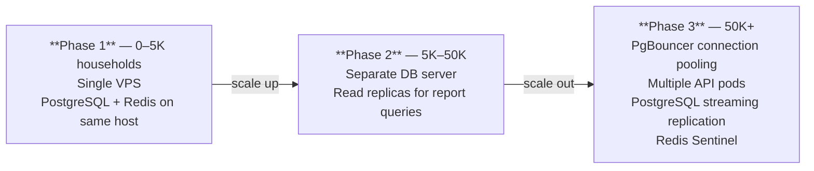

# Moolah — System Architecture & Design Document

> **Version:** 1.0.0 | **Date:** 2026-03-06 | **Status:** Approved

---

## Table of Contents

1. [Executive Summary](#1-executive-summary)
2. [System Architecture](#2-system-architecture)
3. [Data Modeling](#3-data-modeling)
4. [Multi-Tenancy & Admin Strategy](#4-multi-tenancy--admin-strategy)
5. [API Design](#5-api-design)
6. [Project Structure](#6-project-structure)
7. [Security & Observability](#7-security--observability)
8. [Transaction Flows](#8-transaction-flows)
9. [Performance & Scaling](#9-performance--scaling)
10. [CI/CD Pipeline](#10-cicd-pipeline)
11. [Testing Strategy](#11-testing-strategy)

---

## 1. Executive Summary

Moolah is a multi-tenant household budgeting and investment tracking SaaS. Each **Household** is treated as an isolated Tenant. Multiple family members share one tenant, each with their own role. The platform is designed to start lean (MVP: accounts payable and cash flow) and grow incrementally toward credit card installment tracking and investment portfolios.

### Key Architectural Pillars

| Pillar | Decision | Rationale |
| --- | --- | --- |
| Identity | ULID | Monotonic, B-Tree friendly, k-sortable |
| Monetary values | `int64` (cents) | Exact arithmetic; no floating point drift |
| ORM | `sqlc` + raw SQL | Explicit, auditable, type-safe |
| Auth | Email + OTP → Paseto v4 (local) | Passwordless; no algorithm-confusion risk |
| Multi-tenancy | Row-level `tenant_id` | Simple, portable, auditable |
| Soft delete | `deleted_at TIMESTAMPTZ` | Preserves audit trail |
| Framework | `net/http` stdlib (Go 1.26.1) | Zero-dependency HTTP; Go 1.22 routing with `{param}` patterns |
| Migrations | Goose (auto-run on startup) | Zero-touch schema evolution; embedded FS |
| Logging | `log/slog` (stdlib, JSON) | No external dependency; structured JSON to stdout |
| API Docs | Swaggo (annotation-driven) | OpenAPI 2.0 spec generated from handler comments |
| API Testing | Bruno | Git-friendly, open-source IDE for exploring and testing APIs |

---

## 2. System Architecture

### 2.1 High-Level Component Overview

```mermaid
graph TD
    subgraph CLIENT["Client Layer"]
        WEB["Web App (SPA / Mobile)"]
        CLI["CLI Admin Tool"]
    end

    subgraph PROXY["API Gateway / Reverse Proxy"]
        NGX["Nginx / Caddy&#10;TLS Termination"]
    end

    subgraph API["Moolah API — net/http · Go 1.26.1"]
        subgraph HANDLERS["Handlers"]
            AH["Auth Handler"]
            TH["Tenant Handler"]
            FH["Finance Handler"]
            ADH["Admin Handler"]
        end
        SVC["Service Layer&#10;AuthService · TenantService · TransactionService · AdminService"]
        REPO["Repository Layer&#10;Interfaces in domain/ · Implementations in platform/"]
    end

    PG[("PostgreSQL&#10;Primary DB")]
    REDIS[("Redis&#10;OTP / Sessions")]
    SMTP["SMTP / SES&#10;Email Sender"]

    WEB & CLI -->|"HTTPS / REST JSON"| NGX
    NGX --> HANDLERS
    AH & TH & FH & ADH --> SVC
    SVC --> REPO
    REPO --> PG
    REPO --> REDIS
    SVC --> SMTP
```



### 2.2 Auth Flow — OTP Request / Verify & Paseto Token Issuance



### 2.3 Three-Tier Role System

| Role | Scope | Capabilities |
| --- | --- | --- |
| `sysadmin` | Global | View/manage all tenants; bypass `tenant_id` filters; impersonate tenant users for support; manage platform config |
| `admin` | Tenant | Manage household users; invite/remove members; configure categories, accounts, and billing |
| `member` | Tenant | Create/view own transactions; view shared budgets; read-only access to household accounts |

---

## 3. Data Modeling

### 3.1 Entity-Relationship Diagram



### 3.2 Why ULID Over UUID for PostgreSQL

**Problem with random UUIDv4:**
PostgreSQL B-Tree indexes must maintain sorted order. Random UUIDs cause every insert to land in a random position within the index, leading to:

- **Page splits:** The index page at the random position splits, writing two half-full pages — O(n) write amplification.
- **Cache pressure:** No locality of reference; the buffer pool constantly evicts recently-used pages.
- **Bloat:** Fragmented index pages with low fill factors inflate both disk usage and sequential scan costs.

**How ULID solves this:**



- **Temporal monotonicity:** New rows always land at the *rightmost* leaf page of the B-Tree index, eliminating random splits.
- **Fill factor near 100%:** Pages fill sequentially, minimizing index bloat.
- **Range queries by time:** `WHERE id > $cursor` is a natural, efficient time-windowed pagination without a separate `created_at` index for many queries.
- **Benchmark context:** On a 10M-row tenant dataset, ULID inserts show ~40% fewer index page splits vs. UUIDv4, translating directly to lower write latency and smaller index files.

---

## 4. Multi-Tenancy & Admin Strategy

### 4.1 Tenant Isolation — The Core Contract

Every repository method that reads or mutates tenant data **must** accept `tenantID string` as a mandatory argument and embed it in every SQL predicate. This is enforced structurally: the `domain` interface signatures make it impossible to forget.

```go
// internal/domain/transaction.go

package domain

import (
    "context"
    "time"
)

// Transaction is the canonical financial record entity.
type Transaction struct {
    ID               string
    TenantID         string
    AccountID        string
    CategoryID       string
    UserID           string
    MasterPurchaseID *string // nil for simple transactions
    Description      string
    AmountCents      int64
    Type             TransactionType
    OccurredAt       time.Time
    CreatedAt        time.Time
    DeletedAt        *time.Time
}

// TransactionType enumerates the valid transaction flows.
type TransactionType string

const (
    TransactionTypeIncome   TransactionType = "income"
    TransactionTypeExpense  TransactionType = "expense"
    TransactionTypeTransfer TransactionType = "transfer"
)

// TransactionRepository defines the data access contract.
// All read/write methods are tenant-scoped by design.
// The tenantID parameter is MANDATORY — never omit it.
type TransactionRepository interface {
    Create(ctx context.Context, tenantID string, tx Transaction) (Transaction, error)
    GetByID(ctx context.Context, tenantID, id string) (Transaction, error)
    List(ctx context.Context, tenantID string, filter TransactionFilter) ([]Transaction, error)
    SoftDelete(ctx context.Context, tenantID, id string) error
}

// TransactionFilter holds pagination and filtering options.
type TransactionFilter struct {
    AccountID  *string
    CategoryID *string
    From       *time.Time
    To         *time.Time
    Limit      int
    Offset     int
}
```

### 4.2 Middleware Pipeline & Context Propagation

```go
// internal/platform/middleware/auth.go

package middleware

import (
    "context"
    "net/http"

    "github.com/you/moolah/internal/domain"
    "github.com/you/moolah/pkg/pasetoutils"
)

type contextKey string

const (
    ContextKeyTenantID contextKey = "tenant_id"
    ContextKeyUserID   contextKey = "user_id"
    ContextKeyRole     contextKey = "role"
)

// RequireAuth validates the PASETO v4 local token and injects claims into the request context.
func RequireAuth(pasetoKey []byte) func(http.Handler) http.Handler {
    return func(next http.Handler) http.Handler {
        return http.HandlerFunc(func(w http.ResponseWriter, r *http.Request) {
            claims, err := pasetoutils.ParseBearerToken(r.Header.Get("Authorization"), pasetoKey)
            if err != nil {
                http.Error(w, `{"error":{"code":"UNAUTHORIZED","message":"Missing or invalid authentication token"}}`, http.StatusUnauthorized)
                return
            }
            ctx := context.WithValue(r.Context(), ContextKeyTenantID, claims.TenantID)
            ctx = context.WithValue(ctx, ContextKeyUserID, claims.UserID)
            ctx = context.WithValue(ctx, ContextKeyRole, claims.Role)
            next.ServeHTTP(w, r.WithContext(ctx))
        })
    }
}

// RequireRole returns 403 if the caller's role is not in the allowed set.
func RequireRole(allowed ...domain.Role) func(http.Handler) http.Handler {
    set := make(map[domain.Role]struct{}, len(allowed))
    for _, r := range allowed {
        set[r] = struct{}{}
    }
    return func(next http.Handler) http.Handler {
        return http.HandlerFunc(func(w http.ResponseWriter, r *http.Request) {
            role := domain.Role(r.Context().Value(ContextKeyRole).(string))
            if _, ok := set[role]; !ok {
                http.Error(w, `{"error":{"code":"FORBIDDEN","message":"Insufficient role to perform this action"}}`, http.StatusForbidden)
                return
            }
            next.ServeHTTP(w, r)
        })
    }
}
```

### 4.3 System Admin — Bypassing Tenant Isolation

The `sysadmin` role is never given a standard `tenant_id` in its Paseto claim (`tid` is empty or `"*"`). When a System Admin needs to read cross-tenant data, a dedicated **Admin Repository** is used — never the same tenant-scoped interface.

```go
// internal/domain/admin.go

package domain

import "context"

// AdminTenantRepository bypasses row-level tenant isolation.
// It is ONLY injected into the AdminService and NEVER into tenant-scoped services.
type AdminTenantRepository interface {
    ListAllTenants(ctx context.Context, filter PaginationFilter) ([]Tenant, error)
    GetTenantByID(ctx context.Context, id string) (Tenant, error)
    SuspendTenant(ctx context.Context, id string) error
}

// AdminTransactionRepository allows global transaction inspection for support.
type AdminTransactionRepository interface {
    GetTransactionByIDGlobal(ctx context.Context, id string) (Transaction, error)
    ListTransactionsByTenant(ctx context.Context, tenantID string, filter TransactionFilter) ([]Transaction, error)
}
```

The route registration makes the boundary explicit — admin routes use a different set of handlers that depend on admin repositories:

```go
// cmd/api/routes.go (excerpt)

// Chain composes multiple middleware functions left-to-right.
func Chain(middlewares ...func(http.Handler) http.Handler) func(http.Handler) http.Handler {
    return func(final http.Handler) http.Handler {
        for i := len(middlewares) - 1; i >= 0; i-- {
            final = middlewares[i](final)
        }
        return final
    }
}

// Tenant-scoped routes (inject TenantID from Paseto token into every call)
auth := middleware.RequireAuth(cfg.PasetoKey)
mux.Handle("GET /v1/transactions", auth(http.HandlerFunc(transactionHandler.List)))

// System admin routes (NO tenant isolation, sysadmin role required)
adminAuth := Chain(
    middleware.RequireAuth(cfg.PasetoKey),
    middleware.RequireRole(domain.RoleSysAdmin),
)
mux.Handle("GET /v1/admin/tenants", adminAuth(http.HandlerFunc(adminHandler.ListAllTenants)))
mux.Handle("GET /v1/admin/tenants/{tenantID}/transactions", adminAuth(http.HandlerFunc(adminHandler.ListTransactionsByTenant)))
```

---

## 5. API Design

### 5.1 Conventions

| Concern | Decision |
| --- | --- |
| Versioning | URL path prefix: `/v1/` |
| Content-Type | `application/json` |
| Auth header | `Authorization: Bearer <paseto_token>` |
| Error format | `{ "error": { "code": "...", "message": "...", "details": {} } }` |
| Pagination | `?limit=20&offset=0` cursor-ready |
| Timestamps | ISO 8601 / RFC3339 |
| Monetary | Integer cents in JSON: `"amount_cents": 1500` → R$15.00 |
| Idempotency | `Idempotency-Key: <ulid>` header required on all state-mutating `POST` endpoints; 24 h Redis TTL |
| API Documentation | OpenAPI 2.0 generated by Swaggo; `/swagger/*` UI in non-production builds |

### 5.2 Endpoint Reference (Phase 1 MVP)

#### Authentication

| Method | Path | Auth | Description |
| --- | --- | --- | --- |
| `POST` | `/v1/auth/otp/request` | None | Send OTP to email |
| `POST` | `/v1/auth/otp/verify` | None | Verify OTP, receive Paseto token |
| `POST` | `/v1/auth/token/refresh` | Refresh token | Rotate access token |

#### Tenant Management

| Method | Path | Auth | Role | Description |
| --- | --- | --- | --- | --- |
| `POST` | `/v1/tenants` | Token | `sysadmin` | Create household |
| `GET` | `/v1/tenants/me` | Token | any | Get own household |
| `PATCH` | `/v1/tenants/me` | Token | `admin` | Update household info |
| `POST` | `/v1/tenants/me/users` | Token | `admin` | Invite user to household |

#### Accounts

| Method | Path | Auth | Role | Description |
| --- | --- | --- | --- | --- |
| `POST` | `/v1/accounts` | Token | `admin` | Create account |
| `GET` | `/v1/accounts` | Token | `member` | List accounts |
| `GET` | `/v1/accounts/:id` | Token | `member` | Get account |
| `PATCH` | `/v1/accounts/:id` | Token | `admin` | Update account |
| `DELETE` | `/v1/accounts/:id` | Token | `admin` | Soft-delete account |

#### Transactions

| Method | Path | Auth | Role | Description |
| --- | --- | --- | --- | --- |
| `POST` | `/v1/transactions` | Token | `member` | Create transaction |
| `GET` | `/v1/transactions` | Token | `member` | List (paginated, filterable) |
| `GET` | `/v1/transactions/:id` | Token | `member` | Get transaction |
| `PATCH` | `/v1/transactions/:id` | Token | `member` | Update transaction |
| `DELETE` | `/v1/transactions/:id` | Token | `member` | Soft-delete transaction |

#### Categories

| Method | Path | Auth | Role | Description |
| --- | --- | --- | --- | --- |
| `POST` | `/v1/categories` | Token | `admin` | Create category |
| `GET` | `/v1/categories` | Token | `member` | List categories |
| `DELETE` | `/v1/categories/:id` | Token | `admin` | Soft-delete category |

### 5.3 Example JSON Payloads

#### POST `/v1/auth/otp/request`

```json
// Request
{
  "email": "alice@example.com"
}

// Response 202
{
  "message": "A 6-digit code was sent to alice@example.com",
  "expires_in": 600
}
```

#### POST `/v1/auth/otp/verify`

```json
// Request
{
  "email": "alice@example.com",
  "code": "847291"
}

// Response 200
{
  "access_token": "eyJhbGci...",
  "refresh_token": "dGhpcyBp...",
  "token_type": "Bearer",
  "expires_in": 3600
}
```

#### POST `/v1/transactions` — Simple Expense

```json
// Request
{
  "account_id": "01HZK9B2T4X7FWCMPQG3SNVR0E",
  "category_id": "01HZK9B2T4X7FWCMPQG3SNVR0F",
  "description": "Supermarket weekly shop",
  "amount_cents": 32750,
  "type": "expense",
  "occurred_at": "2026-03-06T14:30:00Z"
}

// Response 201
{
  "id": "01HZNVR4X2PFWGJKSTM7QB8DC0",
  "tenant_id": "01HZK8M3P5VBWQNR2XFJTD6L9E",
  "account_id": "01HZK9B2T4X7FWCMPQG3SNVR0E",
  "category_id": "01HZK9B2T4X7FWCMPQG3SNVR0F",
  "description": "Supermarket weekly shop",
  "amount_cents": 32750,
  "type": "expense",
  "occurred_at": "2026-03-06T14:30:00Z",
  "created_at": "2026-03-06T14:31:05Z"
}
```

#### POST `/v1/master-purchases` — Installment Purchase (Phase 2)

```json
// Request — creates 1 master record, NOT 12 individual transactions
{
  "account_id": "01HZK9B2T4X7FWCMPQG3SNVR0E",
  "category_id": "01HZK9B2T4X7FWCMPQG3SNVR0G",
  "description": "New laptop 12x",
  "total_amount_cents": 600000,
  "installment_count": 12,
  "first_due_date": "2026-04-10"
}

// Response 201
{
  "id": "01HZNVR4X2PFWGJKSTM7QB8DC1",
  "total_amount_cents": 600000,
  "installment_count": 12,
  "installment_cents": 50000,
  "first_due_date": "2026-04-10",
  "projected_installments": [
    { "number": 1, "due_date": "2026-04-10", "amount_cents": 50000, "settled": false },
    { "number": 2, "due_date": "2026-05-10", "amount_cents": 50000, "settled": false }
  ]
}
```

#### Error Response (all endpoints)

```json
// 422 Unprocessable Entity
{
  "error": {
    "code": "VALIDATION_FAILED",
    "message": "Request payload validation failed",
    "details": {
      "amount_cents": "must be greater than 0",
      "occurred_at": "must be a valid RFC3339 timestamp"
    }
  }
}

// 401 Unauthorized
{
  "error": {
    "code": "UNAUTHORIZED",
    "message": "Missing or invalid authentication token"
  }
}

// 403 Forbidden
{
  "error": {
    "code": "FORBIDDEN",
    "message": "Insufficient role to perform this action"
  }
}
```

---

## 6. Project Structure

```bash
moolah/
├── api/
│   └── swagger/                  # Auto-generated by `swag init` (do not edit manually)
│       ├── docs.go
│       ├── swagger.json
│       └── swagger.yaml
│
├── cmd/
│   └── api/
│       ├── main.go               # Entry point: config, DI wiring, net/http server bootstrap
│       ├── routes.go             # All route registrations grouped by domain
│       └── server.go             # http.Server factory, middleware chain
│
├── internal/
│   ├── domain/                   # Pure business layer — NO external imports
│   │   ├── account.go            # Account entity + AccountRepository interface
│   │   ├── admin.go              # Admin-only repository interfaces
│   │   ├── audit.go              # AuditLog entity, AuditAction consts + AuditRepository interface
│   │   ├── auth.go               # OTPRequest entity + AuthRepository interface
│   │   ├── category.go           # Category entity + CategoryRepository interface
│   │   ├── errors.go             # Sentinel errors: ErrNotFound, ErrForbidden…
│   │   ├── mailer.go             # Mailer interface (for mockability)
│   │   ├── master_purchase.go    # MasterPurchase entity + repository interface
│   │   ├── role.go               # Role type + constants
│   │   ├── tenant.go             # Tenant entity + TenantRepository interface
│   │   ├── transaction.go        # Transaction entity + TransactionRepository interface
│   │   └── user.go               # User entity + UserRepository interface
│   │
│   ├── platform/
│   │   ├── db/
│   │   │   ├── migrations/       # Goose SQL migration files (auto-applied on startup via embed.FS)
│   │   │   │   ├── 00001_create_enums.sql
│   │   │   │   ├── 00002_create_tenants.sql
│   │   │   │   ├── 00003_create_users.sql
│   │   │   │   └── ...           # each file uses -- +goose Up / -- +goose Down markers
│   │   │   ├── queries/          # Raw SQL files consumed by sqlc
│   │   │   │   ├── accounts.sql
│   │   │   │   ├── categories.sql
│   │   │   │   ├── master_purchases.sql
│   │   │   │   ├── tenants.sql
│   │   │   │   ├── transactions.sql
│   │   │   │   └── users.sql
│   │   │   └── sqlc/             # sqlc-generated Go code (do not edit manually)
│   │   │       ├── db.go
│   │   │       ├── models.go
│   │   │       └── *.sql.go
│   │   │
│   │   ├── middleware/
│   │   │   ├── auth.go           # Paseto v4 token validation + context injection
│   │   │   ├── logger.go         # Request logging
│   │   │   └── ratelimit.go      # OTP rate limiting
│   │   │
│   │   ├── repository/           # domain interface implementations (use sqlc queries)
│   │   │   ├── account_repo.go
│   │   │   ├── admin_repo.go
│   │   │   ├── audit_repo.go
│   │   │   ├── auth_repo.go
│   │   │   ├── category_repo.go
│   │   │   ├── master_purchase_repo.go
│   │   │   ├── tenant_repo.go
│   │   │   ├── transaction_repo.go
│   │   │   └── user_repo.go
│   │   │
│   │   └── mailer/
│   │       └── smtp_mailer.go    # Implements domain.Mailer
│   │
│   ├── service/
│   │   ├── auth_service.go       # OTP generation, verification, Paseto token issuance
│   │   ├── auth_service_test.go
│   │   ├── tenant_service.go     # Household CRUD and user invitation
│   │   ├── tenant_service_test.go
│   │   ├── transaction_service.go
│   │   ├── transaction_service_test.go
│   │   └── admin_service.go      # Cross-tenant support operations
│   │
│   └── testutil/                 # Shared test infrastructure — imported only by *_test.go files
│       ├── containers/           # testcontainers-go wrappers (//go:build integration)
│       │   ├── postgres.go       # NewPostgresDB(t) → *TestPostgresDB{Pool, Queries}
│       │   ├── redis.go          # NewRedisClient(t) → *redis.Client
│       │   └── mailhog.go        # NewMailhogServer(t) → *TestMailhog{Addr, APIAddr}
│       ├── mocks/                # testify/mock implementations (no build tag — safe to compile)
│       │   ├── mock_querier.go   # MockQuerier (implements sqlc.Querier)
│       │   ├── mock_idempotency_store.go  # MockIdempotencyStore (implements middleware.IdempotencyStore)
│       │   └── mock_mailer.go    # MockMailer (implements domain.Mailer)
│       └── seeds/                # Canonical test fixture factories (//go:build integration)
│           ├── tenant.go         # CreateTenant(t, ctx, q) → domain.Tenant
│           ├── user.go           # CreateUser(t, ctx, q, tenantID) → domain.User
│           ├── account.go        # CreateAccount(t, ctx, q, opts) → domain.Account
│           ├── category.go       # CreateCategory(t, ctx, q, tenantID) → domain.Category
│           └── transaction.go    # CreateTransaction(t, ctx, q, opts) → domain.Transaction
│
├── pkg/
│   ├── config/
│   │   └── config.go             # Env-based config with validation
│   ├── pasetoutils/
│   │   └── paseto.go             # Seal/parse PASETO v4 local tokens with typed claims
│   ├── logger/
│   │   └── logger.go             # Structured slog (stdlib) JSON logger
│   ├── otputil/
│   │   └── otp.go                # Cryptographically secure OTP generation
│   └── ulidutil/
│       └── ulid.go               # ULID factory (monotonic, thread-safe)
│
├── docs/
│   ├── tasks/                    # Design tasks
│   ├── ARCHITECTURE.md           # This document
│   ├── ROADMAP.md                # Planned features and timeline
│   └── schema.sql                # Human-readable consolidated DDL
│
├── .github/
│   └── workflows/
│       └── ci.yml                # GitHub Actions pipeline
│
├── docker-compose.yml            # Local dev: postgres + redis
├── Dockerfile                    # Multi-stage production image
├── sqlc.yaml                     # sqlc configuration
├── .golangci.yml                 # Linter configuration
└── Makefile                      # Developer shortcuts
```

### 6.1 Key Code Examples

#### Dependency Injection (main.go)

```go
// cmd/api/main.go

// @title           Moolah API
// @version         1.0
// @description     Household budgeting and investment tracking SaaS.
// @host            localhost:8080
// @BasePath        /v1
// @securityDefinitions.apikey BearerAuth
// @in              header
// @name            Authorization
package main

import (
    "context"
    "database/sql"
    "embed"
    "log/slog"
    "os"

    _ "github.com/jackc/pgx/v5/stdlib" // pgx driver for database/sql (Goose)
    "github.com/jackc/pgx/v5/pgxpool"
    "github.com/pressly/goose/v3"
    "github.com/you/moolah/internal/platform/db/sqlc"
    "github.com/you/moolah/internal/platform/mailer"
    "github.com/you/moolah/internal/platform/repository"
    "github.com/you/moolah/internal/service"
    "github.com/you/moolah/pkg/config"
    "github.com/you/moolah/pkg/logger"
)

//go:embed ../../internal/platform/db/migrations/*.sql
var migrationsFS embed.FS

func main() {
    cfg := config.Load() // panics on missing required env vars
    log := logger.New(cfg.LogLevel)

    // ── Auto-migration via Goose (idempotent — safe to run on every startup) ──
    sqlDB, err := sql.Open("pgx", cfg.DatabaseURL)
    if err != nil {
        log.Error("failed to open sql.DB for migrations", slog.Any("err", err))
        os.Exit(1)
    }
    goose.SetBaseFS(migrationsFS)
    if err := goose.SetDialect("postgres"); err != nil {
        log.Error("goose: set dialect", slog.Any("err", err))
        os.Exit(1)
    }
    if err := goose.Up(sqlDB, "internal/platform/db/migrations"); err != nil {
        log.Error("goose: migration failed", slog.Any("err", err))
        os.Exit(1)
    }
    sqlDB.Close()

    // ── Main connection pool (pgxpool for the sqlc query layer) ───────────────
    pool, err := pgxpool.New(context.Background(), cfg.DatabaseURL)
    if err != nil {
        log.Error("failed to connect to database", slog.Any("err", err))
        os.Exit(1)
    }
    defer pool.Close()

    queries := sqlc.New(pool)

    // Repository layer — implement domain interfaces
    txRepo     := repository.NewTransactionRepository(queries)
    userRepo   := repository.NewUserRepository(queries)
    tenantRepo := repository.NewTenantRepository(queries)
    authRepo   := repository.NewAuthRepository(queries)

    // Infrastructure
    emailer := mailer.NewSMTPMailer(cfg.SMTPConfig)

    // Service layer — receives interfaces, easy to mock in tests
    authSvc := service.NewAuthService(authRepo, userRepo, tenantRepo, emailer, cfg)
    txSvc   := service.NewTransactionService(txRepo, cfg)

    srv := NewServer(cfg, log, authSvc, txSvc)
    if err := srv.ListenAndServe(); err != nil && !errors.Is(err, http.ErrServerClosed) {
        log.Error("server stopped", slog.Any("err", err))
        os.Exit(1)
    }
}
```

#### AuthService with Interface-Driven Design

```go
// internal/service/auth_service.go
package service

import (
    "context"
    "fmt"
    "time"

    "github.com/you/moolah/internal/domain"
    "github.com/you/moolah/pkg/config"
    "github.com/you/moolah/pkg/pasetoutils"
    "github.com/you/moolah/pkg/otputil"
    "github.com/you/moolah/pkg/ulidutil"
)

// AuthService orchestrates OTP generation and Paseto v4 token issuance.
// All dependencies are interfaces — 100% mockable.
type AuthService struct {
    authRepo   domain.AuthRepository
    userRepo   domain.UserRepository
    tenantRepo domain.TenantRepository
    mailer     domain.Mailer
    cfg        config.Config
}

func NewAuthService(
    authRepo domain.AuthRepository,
    userRepo domain.UserRepository,
    tenantRepo domain.TenantRepository,
    mailer domain.Mailer,
    cfg config.Config,
) *AuthService {
    return &AuthService{authRepo, userRepo, tenantRepo, mailer, cfg}
}

// RequestOTP generates and persists a one-time code, then dispatches the email.
func (s *AuthService) RequestOTP(ctx context.Context, email string) error {
    code, err := otputil.Generate(6)
    if err != nil {
        return fmt.Errorf("auth: generate otp: %w", err)
    }

    req := domain.OTPRequest{
        ID:        ulidutil.New(),
        Email:     email,
        Code:      code,
        ExpiresAt: time.Now().UTC().Add(10 * time.Minute),
        CreatedAt: time.Now().UTC(),
    }

    if err := s.authRepo.SaveOTPRequest(ctx, req); err != nil {
        return fmt.Errorf("auth: save otp request: %w", err)
    }

    return s.mailer.SendOTP(ctx, email, code)
}

// VerifyOTP validates a code and returns a signed Paseto v4 token on success.
func (s *AuthService) VerifyOTP(ctx context.Context, email, code string) (domain.TokenPair, error) {
    req, err := s.authRepo.GetValidOTPRequest(ctx, email)
    if err != nil {
        return domain.TokenPair{}, domain.ErrInvalidOTP
    }

    if !otputil.Verify(code, req.Code) {
        return domain.TokenPair{}, domain.ErrInvalidOTP
    }

    if err := s.authRepo.MarkOTPUsed(ctx, req.ID); err != nil {
        return domain.TokenPair{}, fmt.Errorf("auth: mark otp used: %w", err)
    }

    user, err := s.userRepo.GetByEmail(ctx, email)
    if err != nil {
        return domain.TokenPair{}, fmt.Errorf("auth: get user: %w", err)
    }

    claims := pasetoutils.Claims{
        UserID:   user.ID,
        TenantID: user.TenantID,
        Role:     string(user.Role),
    }

    return pasetoutils.Issue(claims, s.cfg.PasetoKey, s.cfg.TokenExpiry)
}
```

#### ULID Utility (Thread-Safe, Monotonic)

```go
// pkg/ulidutil/ulid.go
package ulidutil

import (
    "crypto/rand"
    "sync"
    "time"

    "github.com/oklog/ulid/v2"
)

var (
    entropy ulid.MonotonicEntropy
    mu      sync.Mutex
    base    = ulid.Monotonic(rand.Reader, 0)
)

// New returns a new ULID string. It is safe for concurrent use.
func New() string {
    mu.Lock()
    defer mu.Unlock()
    return ulid.MustNew(ulid.Timestamp(time.Now()), base).String()
}
```

#### Goose Migration File Format

Each migration file lives in `internal/platform/db/migrations/` and uses Goose markers. The binary embeds the directory via `embed.FS` so no external files are shipped.

```sql
-- internal/platform/db/migrations/00002_create_tenants.sql

-- +goose Up
CREATE TABLE tenants (
    id         CHAR(26)     NOT NULL,
    name       VARCHAR(120) NOT NULL,
    plan       tenant_plan  NOT NULL DEFAULT 'free',
    created_at TIMESTAMPTZ  NOT NULL DEFAULT NOW(),
    updated_at TIMESTAMPTZ  NOT NULL DEFAULT NOW(),
    deleted_at TIMESTAMPTZ,
    CONSTRAINT pk_tenants PRIMARY KEY (id)
);

CREATE TRIGGER trg_tenants_updated_at
    BEFORE UPDATE ON tenants
    FOR EACH ROW EXECUTE FUNCTION set_updated_at();

-- +goose Down
DROP TABLE IF EXISTS tenants;
```

Goose uses an advisory lock on the `goose_db_version` table, so concurrent pods at startup do not double-apply migrations.

#### Swaggo Handler Annotation Example

Every handler function carries structured comments that `swag init` parses into `docs/swagger/swagger.json`. The spec is committed to the repo and validated in CI.

```go
// internal/handler/transaction_handler.go (excerpt)

// Create godoc
//
// @Summary      Create a new transaction
// @Description  Records an expense, income, or transfer for the authenticated household
// @Tags         transactions
// @Accept       json
// @Produce      json
// @Param        body  body      CreateTransactionRequest  true  "Transaction payload"
// @Success      201   {object}  domain.Transaction
// @Failure      400   {object}  ErrorResponse
// @Failure      401   {object}  ErrorResponse
// @Failure      422   {object}  ErrorResponse
// @Router       /v1/transactions [post]
// @Security     BearerAuth
func (h *TransactionHandler) Create(w http.ResponseWriter, r *http.Request) {
    // ...
}
```

The Swagger UI route is registered only when `cfg.EnableSwagger` is true (disabled in production):

```go
// cmd/api/routes.go (excerpt)
import (
    httpSwagger "github.com/swaggo/http-swagger"
    _ "github.com/you/moolah/docs/swagger" // registers generated spec
)

if cfg.EnableSwagger {
    mux.Handle("GET /swagger/", httpSwagger.WrapHandler)
}
```

---

## 7. Security & Observability

### 7.1 OTP Rate Limiting

OTP endpoints are the primary abuse vector. A token-bucket middleware (backed by `golang.org/x/time/rate`) is applied before any business logic runs:

```go
// internal/platform/middleware/ratelimit.go
import (
    "net/http"
    "sync"
    "time"

    "golang.org/x/time/rate"
)

type visitor struct {
    limiter  *rate.Limiter
    lastSeen time.Time
}

var (
    mu       sync.Mutex
    visitors = make(map[string]*visitor)
)

// OTPRateLimit allows 5 requests per 15-minute window, keyed by remote IP.
func OTPRateLimit(next http.Handler) http.Handler {
    return http.HandlerFunc(func(w http.ResponseWriter, r *http.Request) {
        key := r.RemoteAddr
        mu.Lock()
        v, ok := visitors[key]
        if !ok {
            v = &visitor{limiter: rate.NewLimiter(rate.Every(15*time.Minute/5), 5)}
            visitors[key] = v
        }
        v.lastSeen = time.Now()
        mu.Unlock()

        if !v.limiter.Allow() {
            w.Header().Set("Content-Type", "application/json")
            w.WriteHeader(http.StatusTooManyRequests)
            w.Write([]byte(`{"error":{"code":"RATE_LIMITED","message":"Too many OTP requests. Please wait before retrying."}}`)) //nolint:errcheck
            return
        }
        next.ServeHTTP(w, r)
    })
}

// cmd/api/routes.go (excerpt)
mux.Handle("POST /v1/auth/otp/request", OTPRateLimit(http.HandlerFunc(authHandler.RequestOTP)))
mux.Handle("POST /v1/auth/otp/verify",  OTPRateLimit(http.HandlerFunc(authHandler.VerifyOTP)))
```

### 7.2 SQL Injection Prevention

`sqlc` generates type-safe Go functions from SQL templates. No string interpolation or dynamic query building ever touches the database layer. Example:

```sql
-- internal/platform/db/queries/transactions.sql
-- Named parameters (@name) are used throughout for self-documenting, order-independent args.
-- Requires sqlc.yaml: query_parameter_limit: 0

-- name: CreateTransaction :one
INSERT INTO transactions (
    id, tenant_id, account_id, category_id, user_id,
    description, amount_cents, type, occurred_at, created_at
) VALUES (
    @id, @tenant_id, @account_id, @category_id, @user_id,
    @description, @amount_cents, @type, @occurred_at, NOW()
)
RETURNING *;

-- name: GetTransactionByID :one
SELECT * FROM transactions
WHERE tenant_id = @tenant_id
  AND id        = @id
  AND deleted_at IS NULL;

-- name: ListTransactions :many
SELECT * FROM transactions
WHERE  tenant_id  = @tenant_id
  AND  deleted_at IS NULL
  AND  (@account_id::text       IS NULL OR account_id  = @account_id)
  AND  (@category_id::text      IS NULL OR category_id = @category_id)
  AND  (@from_date::timestamptz IS NULL OR occurred_at >= @from_date)
  AND  (@to_date::timestamptz   IS NULL OR occurred_at <= @to_date)
ORDER  BY occurred_at DESC
LIMIT  @lim
OFFSET @off;
```

The named parameters generate a typed params struct — fields named exactly after the `@name` values:

```go
// sqlc-generated — no manual editing needed
type GetTransactionByIDParams struct {
    TenantID string
    ID       string
}

func (q *Queries) GetTransactionByID(ctx context.Context, arg GetTransactionByIDParams) (Transaction, error) {
    row := q.db.QueryRow(ctx, getTransactionByID, arg.TenantID, arg.ID)
    // ... scan into struct
}
```

Required `sqlc.yaml` snippet:

```yaml
version: "2"
sql:
  - engine: "postgresql"
    queries: "internal/platform/db/queries"
    schema: "internal/platform/db/migrations"
    gen:
      go:
        package: "sqlc"
        out: "internal/platform/db/sqlc"
        emit_json_tags: true
        emit_interface: true
        query_parameter_limit: 0  # enables @name syntax for all queries
```

### 7.3 Paseto Token Security

PASETO v4 (local) replaces JWT entirely. It eliminates algorithm-confusion attacks (`alg: none`, RS/HS mix-up) by design — the token version and purpose are encoded in the format itself, not in a mutable header field.

| Property | Value |
| --- | --- |
| Version / Purpose | PASETO v4 local (symmetric AEAD: XChaCha20-Poly1305) |
| Expiry | Access token: 1 hour; Refresh token: 7 days |
| Claims | `sub` (userID), `tid` (tenantID), `role`, `jti` (ULID), `iat`, `exp` |
| Key | 32-byte random symmetric key from environment; never hardcoded |
| Refresh | Rotation on use; old `jti` blocklisted in Redis |
| Library | `aidanwoods.dev/go-paseto` |

```go
// pkg/pasetoutils/paseto.go
package pasetoutils

import (
    "errors"
    "time"

    paseto "aidanwoods.dev/go-paseto"
)

var ErrInvalidToken = errors.New("invalid or expired token")

type Claims struct {
    UserID   string `json:"sub"`
    TenantID string `json:"tid"`
    Role     string `json:"role"`
}

// Issue creates and encrypts a PASETO v4 local token from Claims.
func Issue(c Claims, symmetricKey []byte, expiry time.Duration) (TokenPair, error) {
    token := paseto.NewToken()
    token.SetSubject(c.UserID)
    token.SetExpiration(time.Now().UTC().Add(expiry))
    if err := token.Set("tid", c.TenantID); err != nil {
        return TokenPair{}, err
    }
    if err := token.Set("role", c.Role); err != nil {
        return TokenPair{}, err
    }
    key, err := paseto.V4SymmetricKeyFromBytes(symmetricKey)
    if err != nil {
        return TokenPair{}, err
    }
    encrypted := token.V4Encrypt(key, nil)
    return TokenPair{AccessToken: encrypted, ExpiresIn: int(expiry.Seconds())}, nil
}

// ParseBearerToken validates and decrypts a "Bearer <token>" header value.
func ParseBearerToken(header string, symmetricKey []byte) (*Claims, error) {
    const prefix = "Bearer "
    if len(header) <= len(prefix) {
        return nil, ErrInvalidToken
    }
    key, err := paseto.V4SymmetricKeyFromBytes(symmetricKey)
    if err != nil {
        return nil, ErrInvalidToken
    }
    parser := paseto.NewParser()
    parser.AddRule(paseto.NotExpired())
    tok, err := parser.ParseV4Local(key, header[len(prefix):], nil)
    if err != nil {
        return nil, ErrInvalidToken
    }
    var c Claims
    c.UserID, _ = tok.GetSubject()
    _ = tok.Get("tid", &c.TenantID)
    _ = tok.Get("role", &c.Role)
    return &c, nil
}
```

### 7.4 Structured Logging

```go
// pkg/logger/logger.go
package logger

import (
    "log/slog"
    "os"
)

// New returns a *slog.Logger writing structured JSON to stdout.
// level is one of: "debug", "info", "warn", "error".
func New(level string) *slog.Logger {
    var lvl slog.Level
    if err := lvl.UnmarshalText([]byte(level)); err != nil {
        lvl = slog.LevelInfo
    }
    return slog.New(slog.NewJSONHandler(os.Stdout, &slog.HandlerOptions{
        Level:     lvl,
        AddSource: true,
    }))
}
```

Every request log includes `tenant_id`, `user_id`, `method`, `path`, `status`, `latency_ms`, and `request_id` for traceability.

### 7.5 Security Checklist

| Area | Control |
| --- | --- |
| Injection | `sqlc` parameterized queries only |
| XSS | API-only; no server-side rendering |
| CSRF | Paseto token in `Authorization` header (not cookies) |
| Broken Access Control | `tenant_id` enforced in every query; middleware role guard |
| Sensitive Data Exposure | OTP stored as bcrypt hash; tokens never logged |
| Rate Limiting | 5 req / 15 min on OTP endpoints |
| TLS | Enforced at reverse proxy (Caddy auto-HTTPS) |
| Dependency Scanning | `govulncheck` in CI pipeline |

### 7.6 Audit Logging

Every state-changing operation is persisted to `audit_logs` synchronously within the same request. The `actor_id` field answers **who** caused the change:

| Actor | `actor_id` value | Context |
| --- | --- | --- |
| Authenticated user | User ULID from Paseto `sub` claim | All HTTP handlers |
| System Admin | Sysadmin ULID | Cross-tenant support ops |
| Automated job | `"SYSTEM"` constant | `InvoiceCloser`, scheduled tasks |

```go
// internal/domain/audit.go

package domain

import (
    "context"
    "encoding/json"
    "time"
)

// AuditAction enumerates all tracked, state-changing operations.
type AuditAction string

const (
    AuditActionCreate      AuditAction = "create"
    AuditActionUpdate      AuditAction = "update"
    AuditActionSoftDelete  AuditAction = "soft_delete"
    AuditActionRestore     AuditAction = "restore"
    AuditActionLogin       AuditAction = "login"
    AuditActionLoginFailed AuditAction = "login_failed"
    AuditActionOTPRequest  AuditAction = "otp_requested"
    AuditActionOTPVerify   AuditAction = "otp_verified"
)

// ActorSystem is the well-known actor_id for all automated / scheduled jobs.
const ActorSystem = "SYSTEM"

// AuditLog is an immutable event record. Rows are NEVER updated or soft-deleted.
type AuditLog struct {
    ID         string
    TenantID   *string          // nil for global sysadmin operations
    ActorID    string           // user ULID, sysadmin ULID, or ActorSystem
    ActorRole  Role
    Action     AuditAction
    EntityType string           // "transaction", "account", "user", ...
    EntityID   *string          // affected record ULID
    OldValues  json.RawMessage  // JSON snapshot before change (nil for creates)
    NewValues  json.RawMessage  // JSON snapshot after change (nil for hard deletes)
    IPAddress  *string
    UserAgent  *string
    CreatedAt  time.Time
}

// AuditRepository persists and queries audit events.
// Recording strategy: fire-and-log — if audit INSERT fails, log the error
// but do NOT fail the parent business transaction.
type AuditRepository interface {
    Record(ctx context.Context, log AuditLog) error
    ListByEntity(ctx context.Context, tenantID, entityType, entityID string, filter PaginationFilter) ([]AuditLog, error)
    ListByActor(ctx context.Context, actorID string, filter PaginationFilter) ([]AuditLog, error)
    // Admin-only: full tenant audit trail for compliance review
    ListByTenant(ctx context.Context, tenantID string, filter PaginationFilter) ([]AuditLog, error)
}
```

---

### 7.7 Idempotency — Preventing Duplicate Financial Records

#### Problem

In financial systems a user can submit the same mutating request more than once — double-clicking a "Pay" button, a mobile client retrying after a network timeout, or an automated job replaying on failure. Without a deduplication layer, each request would create a distinct record (duplicate transaction, duplicate account, etc.).

#### Strategy — Redis-Backed Idempotency Key

All state-mutating `POST` endpoints **require** an `Idempotency-Key` header. The middleware intercepts the request, checks Redis before the handler executes, and either:

- **New key** — allow the request through, persist the response (status + body) in Redis with a 24 h TTL, return it to the client.
- **In-flight key** (another goroutine is processing the same key) — return `409 Conflict`.
- **Already-processed key** — return the **exact same** cached response without re-executing the handler.



#### Header Contract

| Property | Detail |
| --- | --- |
| Header name | `Idempotency-Key` |
| Value format | Any opaque string ≤ 255 chars; ULID or UUIDv4 recommended |
| Required on | All `POST` endpoints that create or mutate financial records |
| Missing header | `400 Bad Request` with `code: "missing_idempotency_key"` |
| Key scope | Scoped per authenticated user: Redis key = `idempotency:{userID}:{clientKey}` |
| TTL | 24 hours |
| In-flight conflict | `409 Conflict` with `code: "idempotency_key_in_flight"` |

#### Endpoints That Require the Header

| Method | Path | Why |
| --- | --- | --- |
| `POST` | `/v1/transactions` | Creates a financial record — must never duplicate |
| `POST` | `/v1/accounts` | Creates an account |
| `POST` | `/v1/categories` | Creates a category |
| `POST` | `/v1/master-purchases` | Creates installment purchase (Phase 2) |
| `POST` | `/v1/tenants/me/users` | Invites a user — idempotent invite by email |

`GET`, `PATCH`, and `DELETE` endpoints are naturally idempotent and do **not** require the header.

#### Middleware Implementation

```go
// internal/platform/middleware/idempotency.go

package middleware

import (
    "context"
    "encoding/json"
    "net/http"
    "time"

    "github.com/garnizeh/moolah/internal/domain"
)

const (
    idempotencyHeader = "Idempotency-Key"
    idempotencyTTL    = 24 * time.Hour
    keyMaxLen         = 255
    statusLocked      = http.StatusConflict
)

// IdempotencyStore is the Redis-backed store injected into the middleware.
type IdempotencyStore interface {
    // Get retrieves a previously cached response. Returns (nil, nil) on miss.
    Get(ctx context.Context, key string) (*CachedResponse, error)
    // SetLocked atomically acquires the processing lock. Returns false if already locked.
    SetLocked(ctx context.Context, key string, ttl time.Duration) (bool, error)
    // SetResponse stores the final response, replacing the lock.
    SetResponse(ctx context.Context, key string, resp CachedResponse, ttl time.Duration) error
}

// CachedResponse holds the HTTP status and body to replay.
type CachedResponse struct {
    StatusCode int    `json:"status_code"`
    Body       []byte `json:"body"`
}

// Idempotency returns a middleware that deduplicates mutating POST requests
// using the Idempotency-Key header and a Redis-backed store.
func Idempotency(store IdempotencyStore) func(http.Handler) http.Handler {
    return func(next http.Handler) http.Handler {
        return http.HandlerFunc(func(w http.ResponseWriter, r *http.Request) {
            key := r.Header.Get(idempotencyHeader)
            if key == "" || len(key) > keyMaxLen {
                w.Header().Set("Content-Type", "application/json")
                w.WriteHeader(http.StatusBadRequest)
                _ = json.NewEncoder(w).Encode(domain.ErrResponse{Code: "missing_idempotency_key",
                    Message: "Idempotency-Key header is required and must be ≤ 255 chars"})
                return
            }

            userID := r.Context().Value(ContextKeyUserID).(string)
            redisKey := "idempotency:" + userID + ":" + key

            // 1. Check for a previously completed response.
            cached, err := store.Get(r.Context(), redisKey)
            if err == nil && cached != nil {
                w.Header().Set("Content-Type", "application/json")
                w.Header().Set("Idempotent-Replayed", "true")
                w.WriteHeader(cached.StatusCode)
                _, _ = w.Write(cached.Body)
                return
            }

            // 2. Acquire in-flight lock (atomic SETNX).
            acquired, err := store.SetLocked(r.Context(), redisKey, idempotencyTTL)
            if err != nil || !acquired {
                w.Header().Set("Content-Type", "application/json")
                w.WriteHeader(statusLocked)
                _ = json.NewEncoder(w).Encode(domain.ErrResponse{Code: "idempotency_key_in_flight",
                    Message: "A request with the same Idempotency-Key is already being processed"})
                return
            }

            // 3. Capture the response so we can store it.
            rec := &responseRecorder{ResponseWriter: w, statusCode: http.StatusOK}
            next.ServeHTTP(rec, r)

            // 4. Persist the response for future replays (only on success).
            if rec.statusCode < 500 {
                _ = store.SetResponse(r.Context(), redisKey,
                    CachedResponse{StatusCode: rec.statusCode, Body: rec.body},
                    idempotencyTTL)
            }
        })
    }
}
```

#### Redis Key Lifecycle



---

## 8. Transaction Flows

### 8.1 Simple Expense — API Request to DB Persistence



### 8.2 Installment Purchase — Master Purchase Creation (Phase 2)



---

## 9. Performance & Scaling

### 9.1 Indexing Strategy

```sql
-- Composite indexes are the primary weapon for tenant-scoped SaaS performance.
-- Every "hot path" query must hit an index — never a sequential scan.

-- transactions: the most queried table
CREATE INDEX idx_transactions_tenant_account_date
    ON transactions (tenant_id, account_id, occurred_at DESC)
    WHERE deleted_at IS NULL;

CREATE INDEX idx_transactions_tenant_category_date
    ON transactions (tenant_id, category_id, occurred_at DESC)
    WHERE deleted_at IS NULL;

-- Partial indexes (WHERE deleted_at IS NULL) keep the
-- active dataset small; soft-deleted rows are excluded from hot indexes.

-- master_purchases: queried at invoice close
CREATE INDEX idx_master_purchases_tenant_account
    ON master_purchases (tenant_id, account_id, first_due_date)
    WHERE deleted_at IS NULL;

-- users: OTP and login lookups
CREATE INDEX idx_users_tenant_email
    ON users (tenant_id, email)
    WHERE deleted_at IS NULL;
```

### 9.2 Connection Pool Configuration

```go
// cmd/api/main.go (pool configuration)
poolConfig, _ := pgxpool.ParseConfig(cfg.DatabaseURL)
poolConfig.MaxConns = 25               // per pod; scale horizontally
poolConfig.MinConns = 5                // warm connections at startup
poolConfig.MaxConnLifetime = 1 * time.Hour
poolConfig.MaxConnIdleTime = 30 * time.Minute
poolConfig.HealthCheckPeriod = 1 * time.Minute
```

### 9.3 ULID Scaling Analysis

| Metric | UUIDv4 | ULID |
| --- | --- | --- |
| B-Tree page splits / 1M inserts | ~850K | ~12K |
| Index fill factor | ~50% (fragmented) | ~95% (sequential) |
| Index size (10M rows) | ~820 MB | ~480 MB |
| Time-range pagination | Requires separate `created_at` index | `WHERE id > $cursor` works natively |
| Collision probability | 2⁻¹²² per pair | 2⁻⁸⁰ per ms (monotonic) |

At 1,000 households × 500 transactions/month = **500,000 rows/month**, ULID's sequential insert behavior means the index hot page stays in PostgreSQL's shared buffer pool — dramatically reducing I/O.

### 9.4 Horizontal Scaling Path



---

## 10. CI/CD Pipeline

### 10.1 GitHub Actions Workflow

```yaml
# .github/workflows/ci.yml
name: CI Pipeline

on:
  push:
    branches: [main, develop]
  pull_request:
    branches: [main]

env:
  GO_VERSION: "1.26.1"
  GOLANGCI_VERSION: "v1.62"

jobs:
  # ─── Stage 1: Static Analysis ────────────────────────────────────────────
  lint:
    name: Lint
    runs-on: ubuntu-latest
    steps:
      - uses: actions/checkout@v4

      - uses: actions/setup-go@v5
        with:
          go-version: ${{ env.GO_VERSION }}
          cache: true

      - name: golangci-lint
        uses: golangci/golangci-lint-action@v6
        with:
          version: ${{ env.GOLANGCI_VERSION }}
          args: --timeout=5m

      - name: Check sqlc generation is up to date
        run: |
          go install github.com/sqlc-dev/sqlc/cmd/sqlc@latest
          sqlc generate
          git diff --exit-code internal/platform/db/sqlc/

      - name: Check Swagger docs are up to date
        run: |
          go install github.com/swaggo/swag/cmd/swag@latest
          swag init -g cmd/api/main.go -o docs/swagger --parseDependency
          git diff --exit-code docs/swagger/

  # ─── Stage 2: Security Scanning ──────────────────────────────────────────
  security:
    name: Security Scan
    runs-on: ubuntu-latest
    steps:
      - uses: actions/checkout@v4
      - uses: actions/setup-go@v5
        with:
          go-version: ${{ env.GO_VERSION }}

      - name: Run govulncheck
        run: |
          go install golang.org/x/vuln/cmd/govulncheck@latest
          govulncheck ./...

      - name: Run gosec
        uses: securego/gosec@master
        with:
          args: ./...

  # ─── Stage 3: Unit Tests ─────────────────────────────────────────────────
  unit-tests:
    name: Unit Tests
    runs-on: ubuntu-latest
    needs: lint
    steps:
      - uses: actions/checkout@v4
      - uses: actions/setup-go@v5
        with:
          go-version: ${{ env.GO_VERSION }}
          cache: true

      - name: Run unit tests with coverage
        run: |
          go test -v -race -count=1 \
            -coverprofile=coverage.out \
            -covermode=atomic \
            $(go list ./... | grep -v /platform/db/sqlc)

      - name: Enforce coverage threshold (80%)
        run: |
          COVERAGE=$(go tool cover -func=coverage.out | grep total | awk '{print $3}' | tr -d '%')
          echo "Total coverage: ${COVERAGE}%"
          awk "BEGIN { exit (${COVERAGE} < 80) }" || (echo "Coverage below 80%" && exit 1)

      - name: Upload coverage to Codecov
        uses: codecov/codecov-action@v4
        with:
          files: ./coverage.out

  # ─── Stage 4: Integration Tests (testcontainers) ─────────────────────────
  integration-tests:
    name: Integration Tests
    runs-on: ubuntu-latest
    needs: unit-tests
    steps:
      - uses: actions/checkout@v4
      - uses: actions/setup-go@v5
        with:
          go-version: ${{ env.GO_VERSION }}
          cache: true

      - name: Run integration tests (testcontainers-go spins up Postgres)
        run: |
          go test -v -race -count=1 -timeout=120s \
            -tags=integration \
            ./internal/platform/repository/...
        env:
          TESTCONTAINERS_RYUK_DISABLED: "false"

  # ─── Stage 5: Build & Push Docker Image ──────────────────────────────────
  build:
    name: Build Docker Image
    runs-on: ubuntu-latest
    needs: [unit-tests, integration-tests, security]
    if: github.ref == 'refs/heads/main'
    steps:
      - uses: actions/checkout@v4

      - name: Set up Docker Buildx
        uses: docker/setup-buildx-action@v3

      - name: Login to GitHub Container Registry
        uses: docker/login-action@v3
        with:
          registry: ghcr.io
          username: ${{ github.actor }}
          password: ${{ secrets.GITHUB_TOKEN }}

      - name: Build and push
        uses: docker/build-push-action@v5
        with:
          context: .
          push: true
          tags: ghcr.io/${{ github.repository }}:${{ github.sha }}
          cache-from: type=gha
          cache-to: type=gha,mode=max
```

### 10.2 Integration Test Pattern (testcontainers-go)

```go
// internal/platform/repository/transaction_repo_test.go
//go:build integration

package repository_test

import (
    "context"
    "testing"

    "github.com/stretchr/testify/assert"
    "github.com/stretchr/testify/require"
    "github.com/testcontainers/testcontainers-go/modules/postgres"
    "github.com/you/moolah/internal/platform/repository"
    "github.com/you/moolah/pkg/ulidutil"
)

func TestTransactionRepository_CreateAndGet(t *testing.T) {
    ctx := context.Background()

    // Spin up an ephemeral Postgres container
    pgContainer, err := postgres.Run(ctx,
        "postgres:17-alpine",
        postgres.WithDatabase("moolah_test"),
        postgres.WithUsername("test"),
        postgres.WithPassword("test"),
    )
    require.NoError(t, err)
    t.Cleanup(func() { pgContainer.Terminate(ctx) })

    dsn, err := pgContainer.ConnectionString(ctx, "sslmode=disable")
    require.NoError(t, err)

    repo := repository.NewTransactionRepository(mustConnect(t, dsn))

    tenantID := ulidutil.New()
    want := domain.Transaction{
        ID:          ulidutil.New(),
        TenantID:    tenantID,
        AccountID:   ulidutil.New(),
        AmountCents: 12500,
        Type:        domain.TransactionTypeExpense,
        Description: "Coffee shop",
    }

    created, err := repo.Create(ctx, tenantID, want)
    require.NoError(t, err)
    assert.Equal(t, want.AmountCents, created.AmountCents)

    got, err := repo.GetByID(ctx, tenantID, created.ID)
    require.NoError(t, err)
    assert.Equal(t, created.ID, got.ID)

    // Verify tenant isolation: fetching with wrong tenantID must fail
    _, err = repo.GetByID(ctx, ulidutil.New(), created.ID)
    assert.ErrorIs(t, err, domain.ErrNotFound)
}
```

### 10.3 Makefile (Developer Experience)

```makefile
# Makefile
.PHONY: dev lint test test-integration generate migrate-up migrate-down swag build

## dev: Run local dev stack (docker-compose postgres + redis)
dev:
 docker compose up -d postgres redis

## lint: Run golangci-lint
lint:
 golangci-lint run ./...

## test: Run unit tests with coverage
test:
 go test -v -race -count=1 -coverprofile=coverage.out ./...
 go tool cover -html=coverage.out -o coverage.html

## test-integration: Run integration tests (requires Docker)
test-integration:
 go test -v -race -count=1 -tags=integration -timeout=120s ./internal/platform/repository/...

## generate: Regenerate sqlc Go code from .sql query files
generate:
 sqlc generate

## migrate-up: Apply all pending Goose migrations manually (auto-runs on app startup)
migrate-up:
 GOOSE_DRIVER=postgres GOOSE_DBSTRING="$(DATABASE_URL)" \
   goose -dir internal/platform/db/migrations up

## migrate-down: Rollback the last Goose migration
migrate-down:
 GOOSE_DRIVER=postgres GOOSE_DBSTRING="$(DATABASE_URL)" \
   goose -dir internal/platform/db/migrations down

## swag: Regenerate Swagger/OpenAPI docs from handler annotations
swag:
 swag init -g cmd/api/main.go -o docs/swagger --parseDependency

## build: Build production binary
build:
 CGO_ENABLED=0 GOOS=linux go build -ldflags="-s -w" -o bin/api ./cmd/api
```

---

## 11. Testing Strategy

### 11.1 Philosophy

All business logic is unit-tested against interfaces using `testify/mock`; no real database or external service is touched by unit tests. Integration tests run against real ephemeral containers (`testcontainers-go`) and are gated behind the `integration` build tag. This separation keeps the unit test suite fast (< 5 s) and the integration tests thorough.

| Layer | Test type | Infrastructure | Build tag |
| --- | --- | --- | --- |
| `internal/domain` | Unit | None | *(none)* |
| `internal/service` | Unit | `testutil/mocks` | *(none)* |
| `internal/platform/middleware` | Unit | `testutil/mocks` | *(none)* |
| `internal/platform/repository` | Integration | `testutil/containers` + `testutil/seeds` | `integration` |
| `internal/platform/mailer` | Integration | `testutil/containers` (Mailhog) | `integration` |
| `internal/platform/idempotency` | Integration | `testutil/containers` (Redis) | `integration` |

### 11.2 Centralized Test Infrastructure — `internal/testutil`

To prevent code duplication across test files, all shared test infrastructure lives in `internal/testutil` and its sub-packages. Production code **never** imports `testutil`; the dependency arrow is strictly one-way.

```text
internal/testutil/
├── containers/                    # testcontainers-go wrappers (integration tests only)
│   ├── postgres.go                # NewPostgresDB(t) → *TestPostgresDB{Pool, Queries}
│   ├── redis.go                   # NewRedisClient(t) → *redis.Client
│   └── mailhog.go                 # NewMailhogServer(t) → *TestMailhog{Addr, APIAddr}
├── mocks/                         # testify/mock implementations (unit + integration)
│   ├── mock_querier.go            # MockQuerier (implements sqlc.Querier)
│   ├── mock_idempotency_store.go  # MockIdempotencyStore (implements middleware.IdempotencyStore)
│   └── mock_mailer.go             # MockMailer (implements domain.Mailer)
└── seeds/                         # Canonical test-data factories (integration tests)
    ├── tenant.go                  # CreateTenant(t, ctx, q) → domain.Tenant
    ├── user.go                    # CreateUser(t, ctx, q, tenantID) → domain.User
    ├── account.go                 # CreateAccount(t, ctx, q, opts) → domain.Account
    ├── category.go                # CreateCategory(t, ctx, q, tenantID) → domain.Category
    └── transaction.go             # CreateTransaction(t, ctx, q, opts) → domain.Transaction
```

### 11.3 Container Helpers (Build Tag: `integration`)

Each container helper follows the same pattern: spin up, register `t.Cleanup` for teardown, return a typed handle. Callers **never** call `container.Terminate` manually — cleanup is always delegated to `t.Cleanup`.

```go
// internal/testutil/containers/postgres.go
//go:build integration

package containers

import (
    "context"
    "testing"

    "github.com/jackc/pgx/v5/pgxpool"
    "github.com/stretchr/testify/require"
    "github.com/testcontainers/testcontainers-go/modules/postgres"

    "github.com/garnizeh/moolah/internal/platform/db/sqlc"
)

// TestPostgresDB holds an active pgxpool and the sqlc Queries layer bound to it.
type TestPostgresDB struct {
    Pool    *pgxpool.Pool
    Queries *sqlc.Queries
}

// NewPostgresDB starts an ephemeral PostgreSQL container, applies all migrations
// via docs/schema.sql, and returns a connected TestPostgresDB.
// The container and pool are cleaned up when t completes.
func NewPostgresDB(t *testing.T) *TestPostgresDB {
    t.Helper()
    ctx := context.Background()

    pgc, err := postgres.Run(ctx,
        "postgres:17-alpine",
        postgres.WithDatabase("moolah_test"),
        postgres.WithUsername("test"),
        postgres.WithPassword("test"),
    )
    require.NoError(t, err)

    dsn, err := pgc.ConnectionString(ctx, "sslmode=disable")
    require.NoError(t, err)

    pool, err := pgxpool.New(ctx, dsn)
    require.NoError(t, err)

    t.Cleanup(func() {
        pool.Close()
        _ = pgc.Terminate(ctx)
    })

    return &TestPostgresDB{
        Pool:    pool,
        Queries: sqlc.New(pool),
    }
}
```

For packages that test multiple related entities, the container is shared across all tests via `TestMain` to avoid spinning up a new container per test function:

```go
// internal/platform/repository/main_test.go
//go:build integration

package repository_test

import (
    "os"
    "testing"

    "github.com/garnizeh/moolah/internal/testutil/containers"
)

var sharedDB *containers.TestPostgresDB

func TestMain(m *testing.M) {
    // Spin up once, share across all tests in the package, tear down once.
    t := &testing.T{}
    sharedDB = containers.NewPostgresDB(t)
    os.Exit(m.Run())
}
```

### 11.4 Mock Implementations

All mocks use `github.com/stretchr/testify/mock`. They live in `internal/testutil/mocks` and carry no build tag — they import only `testify/mock` and domain types, so they are safe to compile in all environments.

```go
// internal/testutil/mocks/mock_mailer.go
package mocks

import (
    "context"

    "github.com/stretchr/testify/mock"

    "github.com/garnizeh/moolah/internal/domain"
)

// MockMailer is a testify mock for domain.Mailer.
type MockMailer struct {
    mock.Mock
}

func (m *MockMailer) SendOTP(ctx context.Context, email, code string) error {
    args := m.Called(ctx, email, code)
    return args.Error(0)
}

// Compile-time interface check.
var _ domain.Mailer = (*MockMailer)(nil)
```

The `MockIdempotencyStore` is extracted from its inline definition in `idempotency_test.go` and moved here, making it reusable by handler tests in addition to middleware tests.

### 11.5 Seed Helpers

Seed helpers insert minimal valid rows into a real database. They call `require.NoError(t, err)` internally so a seeding failure immediately fails the test with a descriptive message — no error-checking boilerplate in test bodies.

```go
// internal/testutil/seeds/tenant.go
//go:build integration

package seeds

import (
    "context"
    "testing"

    "github.com/stretchr/testify/require"

    "github.com/garnizeh/moolah/internal/domain"
    "github.com/garnizeh/moolah/internal/platform/db/sqlc"
    "github.com/garnizeh/moolah/pkg/ulid"
)

// CreateTenant inserts a test tenant row and returns the mapped domain.Tenant.
func CreateTenant(t *testing.T, ctx context.Context, q sqlc.Querier) domain.Tenant {
    t.Helper()
    row, err := q.CreateTenant(ctx, sqlc.CreateTenantParams{
        ID:   ulid.New(),
        Name: "Test Household",
        Plan: sqlc.TenantPlanFree,
    })
    require.NoError(t, err)
    return domain.Tenant{
        ID:        row.ID,
        Name:      row.Name,
        Plan:      domain.TenantPlan(row.Plan),
        CreatedAt: row.CreatedAt.Time,
        UpdatedAt: row.UpdatedAt.Time,
    }
}
```

### 11.6 Build Tag Conventions

| Sub-package | Build tag | Rationale |
| --- | --- | --- |
| `testutil/containers` | `//go:build integration` | Imports testcontainers-go; only needed for integration runs |
| `testutil/mocks` | *(none)* | Imports only `testify/mock` + domain types; safe to compile in all environments |
| `testutil/seeds` | `//go:build integration` | Uses a live database; only valid in integration runs |

---

## Appendix A — Architectural Decision Records

### ADR-001: ULID over UUIDv4

- **Status:** Accepted
- **Context:** High-frequency insert workload on multi-tenant tables. UUID random scatter causes B-Tree page splits and index bloat.
- **Decision:** Use ULID (128-bit, 48-bit ms timestamp + 80-bit random). Stored as `CHAR(26)`.
- **Consequences:** Sequential inserts, time-sortable without secondary index, slightly larger than UUID (26 chars vs 36 with hyphens but smaller than `uuid` native type).

### ADR-002: Monetary Values as int64 (cents)

- **Status:** Accepted
- **Context:** IEEE 754 float arithmetic is inexact (0.1 + 0.2 ≠ 0.3). Finance applications require exact arithmetic.
- **Decision:** Store all monetary values as `INT8` (cents). Display layer converts: `amountCents / 100`.
- **Consequences:** Simple math, no rounding errors, compatible with PostgreSQL `NUMERIC` migration path.

### ADR-003: Ghost Transactions / Master Purchase Pattern

- **Status:** Accepted (Phase 2)
- **Context:** Credit card installments: naively creating 12 DB rows immediately bloats `transactions` and complicates edits.
- **Decision:** One `master_purchases` row stores the deal metadata. Physical `transactions` rows are created only at invoice closing time.
- **Consequences:** Leaner DB, projections computed in Go at query time, invoice close job needed (batch or event-driven).

### ADR-004: Email + OTP Only (No Passwords)

- **Status:** Accepted
- **Context:** Password management introduces breach risk (hashing, reset flows, complexity policies). Family finance app has a trusting user base.
- **Decision:** Passwordless via 6-digit OTP on email. JWT returned on success.
- **Consequences:** Dependency on email deliverability. Mitigated by transactional email provider (SES/SendGrid) + fallback.

### ADR-005: sqlc over GORM

- **Status:** Accepted
- **Context:** ORMs abstract SQL but introduce runtime query magic, N+1 risk, and opaque error messages.
- **Decision:** Hand-written SQL + sqlc code generation gives full control, type safety, and zero runtime overhead.
- **Consequences:** More SQL boilerplate upfront; compensated by sqlc automation and predictable query plans.

### ADR-006: PASETO v4 (local) over JWT

- **Status:** Accepted
- **Context:** JWT allows the `alg` header to be tampered (`alg: none`, RS/HS confusion). Libraries that trust the header field are exploitable. The household finance context also favours symmetric tokens over public-key infrastructure.
- **Decision:** Use PASETO v4 local with XChaCha20-Poly1305. The algorithm is non-negotiable and embedded in the token format, not in a mutable header field.
- **Consequences:** Tokens are opaque (not inspectable via jwt.io). The 32-byte symmetric key must be rotated with care. Existing JWT-based sessions are invalidated on rollout — coordinated deployment required.

### ADR-007: Goose for Database Migrations

- **Status:** Accepted
- **Context:** `golang-migrate` requires coordinating an external binary invocation with deployment. "Forgot to migrate" bugs are a recurring operational risk in multi-pod or CD-automated environments.
- **Decision:** Use Goose (`pressly/goose/v3`) with `embed.FS` so migration SQL files are compiled into the binary. `goose.Up()` is called synchronously at startup before the connection pool opens, using Goose's built-in advisory lock to prevent concurrent double-application.
- **Consequences:** Down migrations exist for rollback but must be tested explicitly. Schema changes that are not backward-compatible require a coordinated blue-green deployment.

### ADR-008: `log/slog` (stdlib) over zerolog

- **Status:** Accepted
- **Context:** zerolog is performant but adds an external dependency and a non-standard API. Go 1.21 introduced `log/slog` with structured JSON support, leveled logging, and an extensible `slog.Handler` interface.
- **Decision:** Use `log/slog` with `slog.NewJSONHandler` from the standard library. Zero external dependencies; native integration with Go's ecosystem and future tooling.
- **Consequences:** `slog` lacks zerolog's fluent method-chaining style. Call sites are slightly more verbose (`slog.Any("key", val)` vs `.Err(err)`). Tradeoff accepted for zero dependency overhead and long-term stdlib stability.

### ADR-009: Swaggo for API Documentation

- **Status:** Accepted
- **Context:** A hand-maintained OpenAPI spec drifts out of sync with the implementation. The API surface is the primary integration contract for the web client and any future mobile apps.
- **Decision:** Use `swaggo/swag` to generate `swagger.json` / `swagger.yaml` from structured Go doc comments on handler functions. The spec is regenerated in CI (`swag init`) and committed; `git diff --exit-code docs/swagger/` enforces that the committed spec is always fresh.
- **Consequences:** Handler functions require annotation comments. Swagger UI is served only when `cfg.EnableSwagger = true` (disabled in production). Spec generation adds one CI step but removes all manual spec maintenance.
