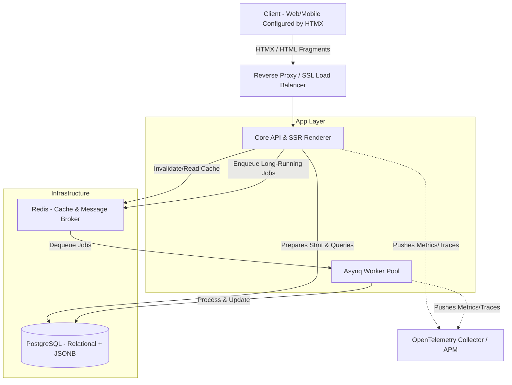
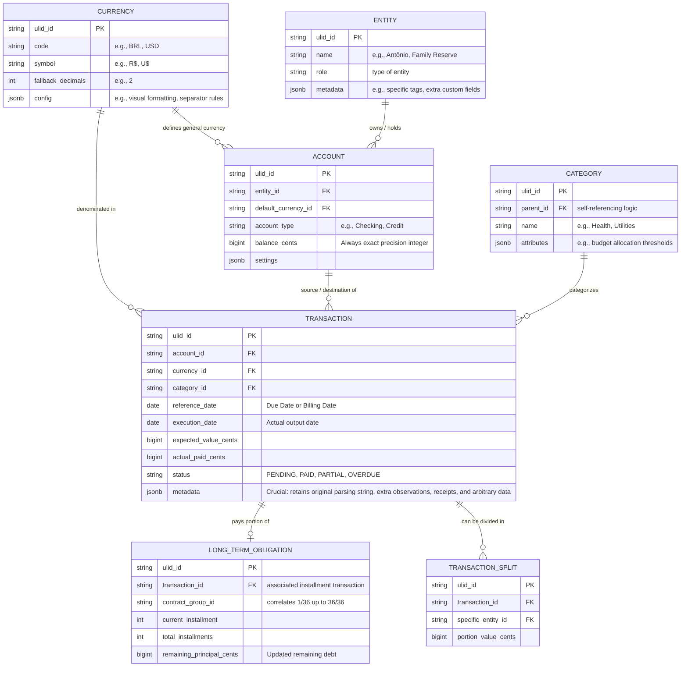

# RFC 003: Moolah - Product & Architecture Proposal

## 1. Product Vision
**Moolah** is envisioned as a highly extensible domestic finance management system, focused on replacing manual spreadsheets and evolving into a family financial intelligence platform. Unlike the initial design specification, the product will not be limited to static tracking or a literal replication of previous spreadsheets; it will build a solid, abstract, and flexible foundation capable of handling complex scenarios (multiple entities/family members, financing, investments, and projections).

### 1.1 Core Product Assumptions
*   **Centralized Extensibility:** The system must freely adapt to asset growth and progressive family complexity (expense splits, alimony, allowances, multiple income sources, and varied metadata) without the imperative need for major database schema refactorings.
*   **Currency Management:** The system will not be tied exclusively to the Real (BRL). There will be a currency registry (Currencies) allowing the configuration of all visual details at the application level (symbol, code).
*   **Absolute Monetary Precision (Always Cents):** All money must be stored and operated in the database at its smallest fraction (in **cents**, using large integers). Visual display conversion and precision (defining how many decimal places the interface will have) will be controlled by the Currency configuration, avoiding fluctuations and rounding errors inherent in floating-point arithmetic.

---

## 2. Product Scope and Phases (Phasing)

### 2.1 Phase 1: MVP - Minimum Viable Product (Spreadsheet Replacement)
The immediate focus is to stabilize cash flow control and eradicate human error from spreadsheets, maintaining a model that already enables future extensions.
*   **Extensible Entity Management:** Registration of family members or cost centers (Antônio, Sarah, Isabella, House) for exact attribution of the expense source/destination.
*   **Wallet and Account Management:** Creation of Checking Accounts and Credit Cards linked to Entities.
*   **Currency Engine (Visual Configuration and Precision):** Currency registry for transaction bases, determining how many decimals to present (e.g., 2 for BRL, 0 for JPY, or up to 8 for crypto).
*   **Basic Income and Expense Entries:**
    *   One-off and recurring entries (Basic cash flow).
    *   Hierarchical categorization (e.g., Housing > Electricity Bill).
    *   Real control status: Predicted (Pending), Partially Paid, Paid, or Overdue.
*   **Financing and Installments (Debt/Loans):** Entry of long-term obligations. Instead of entering loose months, the system must associate entries with a master installment contract tracking remaining installments.
*   **MVP Dashboards:** Consolidated view of Income vs. Expenses (Expected vs. Paid), and algorithmic calculation of divergence ("pending"/variance) at month-end to identify accounting leaks.

### 2.2 Future Phases (Expansion and Automated Intelligence)
*   **Advanced Investment Module:** Complete asset management with automatic Weighted Average Cost (WAC) recalculation, open positions, and integration with percentage variance/distance from a parameterized Target Allocation.
*   **Mobile Analytical Engine (Forecasting):** Projections driven by captured history, calculating 12-month moving averages for utilities, projecting cost of living across macroeconomic scenarios (Retirement 2040).
*   **Complex Splitting (Splits):** Functionality to dynamically and precisely allocate joint expenses among different people/entities within the system.
*   **Reconciliation Integrations (Open Finance/CSVs):** Massive statement import for automated detection and quick linking to "expected payments."
*   **Consolidated Exchange and Multi-Currency:** Periodic quote updates via background worker to visualize Net Worth converted to a unified currency.

---

## 3. Technical Architecture and Resources

Targeting extreme performance, security, ease of implementation, and low memory consumption, Moolah will consolidate its stack using minimalist yet industrially scalable patterns.

### 3.1 Technologies and Layers
*   **Backend:** Golang 1.22+. Core use of the Standard Library (`net/http`, `Mux`, native `context`).
*   **Primary Database:** PostgreSQL, serving as the "Single Source of Truth," with heavy use of the `JSONB` type to enable an extensible schema, ensuring that adding fields doesn't generate downtime or constant severe migrations.
*   **Connection Layer:** `sqlc` (to generate type-safe and performant Go code directly from SQL) instead of using generic ORMs.
*   **Queue and Cache:** Redis coupled with `hibiken/asynq` serving as the task broker for scheduled and heavy processes created in Future Phases.
*   **Frontend (Hypermedia/SSR):** HTMX processing Server-Side Rendered HTML (Go Templates). Styling via Tailwind CSS. Client-side exclusive micro-interactivities via Alpine.js.
*   **Observability:** Structured `log/slog` based on Request IDs (ULID), natively injected into OpenTelemetry (OTel) context spans.

### 3.2 System Architecture Overview

### 3.3 Phased Architecture
#### 3.3.1 Phase 1 Architecture (MVP)
In the MVP, we chose to drop complicated infrastructure. Cache and background jobs, although documented, can be operationally suppressed (discarding Redis), performing all operations in "direct-to-DB" mode, as the initial transactional volume behaves incredibly well under Go's standard async Postgres pool connections.
*   **Initial Actions:** The backend focuses entirely on exposing server-side screens using TailwindCSS with strict input validation, persistent RequestID in logs, and recording Entities, Currencies, and Transactions with `ULID` keys (optimized for DB indexing).
*   **Initial Features:** Reactive DOM panels, individual or bulk record entry/update.

#### 3.3.2 Future Phases Architecture (Advances)
When the system supports robust statement imports (CSV parsing) and infinite predictability reconciliation or simulation:
*   **Advanced Actions:** We will fully instantiate the Redis cluster. The Go Server will send files to the `asynq` broker. Workers will act in parallel, freeing up the main HTTP loop. Reconciliation inferences will occur offline without web timeouts.
*   **Evolved Features:** Retroactive WAC calculation with continuous in-memory caching for instant Dashboard response, background generation of dense reports.

---

## 4. Domain Design and Extensible Schema (Data Model)

The fields in this schema were designed to anticipate future phases. The core of this hybrid model is to use rigid columns for indexing, accounting consistency, and fundamental references, while using descriptive columns of open properties based on PostgreSQL's JSONB engine (the generic `metadata` field).

### 4.1 Entity-Relationship Diagram (Extensible)

### 4.2 Frictionless Extensibility Logic
1.  **The Universal Cents Rule (`bigint*_cents`):** Storage will ignore visual formatting. A payment of $9,450.30 is persisted as `945030`. In a potential investment operating with a cryptocurrency requiring 8 decimal places (1.00000000 BTC), the persisted value operates with the currency's base unit (Satoshi), managed by `fallback_decimals=8` in its respective Currency entity, entirely within the HTMX view.
2.  **Future-Proof Schema (`JSONB` Metadata):** Every main model has a binary-JSON field (`metadata`, `config`, or `attributes`). This means that tomorrow, if obligations need a "Tax_Invoice_Key," "PIX_Originating_Bank," or "Dashboard_Badge_Colors," these will be absorbed directly into metadata without needing to rewrite the SQL database schema.
3.  **Entity Table and Split (Transaction_Split):** Native capability for "shared child support," "shared rent and utility divisions," where an original 1000-cent `TRANSACTION` has Splits generated of 500 cents for Entity X and 500 for Entity Y, all while preserving strict, auditable accounting.
